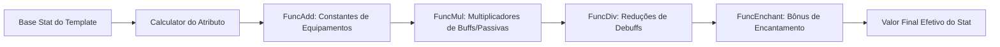
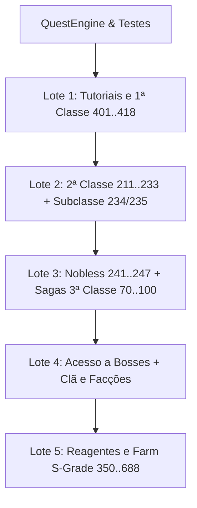
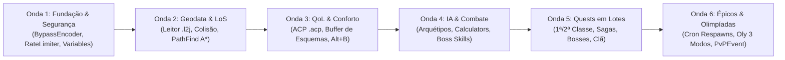

# Roteiro Final Consolidado, Paridade Absoluta & Estudo Comparativo L2JLucera2 — L2JLopez

> **Documento Canônico de Engenharia, Regras de Negócio, Geodata, IA Retail, Fórmulas e Arquitetura**  
> **Versão de Referência**: Lineage II Interlude (Chronicle 6, Protocolo 746)  
> **Bases Analisadas**: `L2JDream V2` (base original) & `L2JLucera2 Interlude` (referência técnica avançada)  
> **Destino**: `D:\Cristiano\Lineage\L2JLopez` (Java 21 LTS, Spring Boot 3.5, Virtual Threads, Spring Data JDBC, HikariCP, Flyway V1..V124)  
> **Status de Qualidade**: **559 Testes Automatizados com 100% de Sucesso (0 Erros, 0 Falhas, 0 Skips)**  
> **Diretriz de Escopo**: Foco estrito em **Engine, Gameplay, Segurança, Geodata, Quests e Qualidade de Vida (QoL)**. Subsistemas de monetização/doações e moedas custom estão expressamente fora do escopo.

---

## Sumário do Roteiro
1. [Sumário Executivo & Diagnóstico](#1-sumário-executivo--diagnóstico)
2. [Comparativo Estruturado: Estudo Próprio (L2JDream V2 & Cliente) vs. Estudo Técnico L2JLucera2](#2-comparativo-estruturado-estudo-próprio-l2jdream-v2--cliente-vs-estudo-técnico-l2jlucera2)
3. [Camada de Cliente, Modding & Correção de Ambiente (`L2jEder_PatchFiles` e Interlude)](#3-camada-de-cliente-modding--correção-de-ambiente-l2jeder_patchfiles-e-interlude)
4. [Pilares de Engenharia Importados da Lucera2 & Diretriz de Zero Doações](#4-pilares-de-engenharia-importados-da-lucera2--diretriz-de-zero-doações)
5. [Matriz Consolidada dos 118 Subsistemas Estruturais com Enriquecimento Lucera](#5-matriz-consolidada-dos-118-subsistemas-estruturais-com-enriquecimento-lucera)
6. [Matriz Integral de Validações Retail e Anti-Exploits (37 Regras)](#6-matriz-integral-de-validações-retail-e-anti-exploits-37-regras)
7. [Motor de Stats, Calculators e Fórmulas Matemáticas](#7-motor-de-stats-calculators-e-fórmulas-matemáticas)
8. [Geodata, Colisão e Pathfinding A* (.l2j)](#8-geodata-colisão-e-pathfinding-a-l2j)
9. [Inteligência Artificial Retail: Arquétipos e IAs Nomeadas](#9-inteligência-artificial-retail-arquétipos-e-ias-nomeadas)
10. [Catálogo & Expansão do Motor de Quests (Referência 349 Quests)](#10-catálogo--expansão-do-motor-de-quests-referência-349-quests)
11. [Grand Bosses, Olimpíadas e Sistema de Eventos](#11-grand-bosses-olimpíadas-e-sistema-de-eventos)
12. [Qualidade de Vida (QoL): ACP, Buffer de Esquemas e Community Board (100% In-Game)](#12-qualidade-de-vida-qol-acp-buffer-de-esquemas-e-community-board-100-in-game)
13. [Plano de Ação Sequencial em Ondas de Implementação](#13-plano-de-ação-sequencial-em-ondas-de-implementação)

---

## 1. Sumário Executivo & Diagnóstico

O **L2JLopez** alcançou uma fundação moderna única no cenário de Lineage II Interlude: arquitetura em **Java 21 LTS**, concorrência via **Virtual Threads**, injeção de dependências limpa com **Spring Boot 3.5**, persistência transacional com **HikariCP** e uma suíte ativa com **559 testes automatizados com 100% de sucesso (0 erros, 0 falhas, 0 skips)**.

Este documento consolida de forma definitiva a união entre o **Estudo Próprio do Desenvolvedor** (focado no modding de cliente, modernização da base L2JDream V2, remoção de God Classes e 37 regras retail) e o **Estudo Técnico da L2JLucera2** (referência comercial descompilada com 349 quests, GeoEngine 3D, BypassManager, packetfilter e segregação de IA).

> [!IMPORTANT]
> **DIRETRIZ ESTRITA DE ESCOPO: ZERO DOAÇÕES**  
> Fica terminantemente definido que o projeto **não terá qualquer sistema de doações**, entrega de compras web (`items_delayed`), moeda de donator (ex: ID 9300) ou NPCs de donatário (40012/40025). Todos os subsistemas (Buffer de esquemas, Auto-potions .acp, Resets, Roleta, Teleportes e Cosméticos DressMe) operam estritamente sobre a **economia orgânica in-game** (Adena, farm retail e moedas de eventos clássicos).

---

## 2. Comparativo Estruturado: Estudo Próprio (L2JDream V2 & Cliente) vs. Estudo Técnico L2JLucera2

O confronto direto entre os dois estudos revela que eles não concorrem, mas sim se complementam perfeitamente:

| Área Técnica | Estudo Próprio do Desenvolvedor (L2JDream V2 + L2JLopez) | Estudo Técnico L2JLucera2 (Referência Avançada) | Síntese de Paridade & Solução Canônica L2JLopez |
|---|---|---|---|
| **Arquitetura & Runtime** | • **Java 21 LTS** com Virtual Threads (`Thread.ofVirtual()`). • Spring Boot 3.5 com IoC total (zero `getInstance()`). • HikariCP + Spring Data JDBC + 124 migrations Flyway. • 559 testes automatizados (0 falhas). | • Java 8 compilado com Ant/Eclipse. • ThreadPoolManager pesado e queues NIO proprietárias. • DBCP/MySQL direto sem migrations. • Zero testes automatizados. | **Adotar 100% da arquitetura do Lopez (Java 21 + Spring Boot + Virtual Threads + Flyway).** O Lucera é legado nesse aspecto. |
| **Segurança de Protocolo** | • Double Lock atômico `Math.min(id1, id2)` em trades/wh. • `FloodProtector` básico e `WordFilterTable`. • Bypasses processados diretamente no `GameSession`. | • **`BypassManager`**: Tokens de sessão únicos (`0_a1`, `0_a2`) impedindo bypasses forjados. • **`packetfilter.xml`**: Filtro declarativo por taxa/ms. • `chatfilters.xml` composto com redirects. | **Importar a blindagem do Lucera**: Adotar `BypassEncoderService` e `PacketRateLimiter` para blindar o protocolo de rede contra exploits. |
| **Camada de Cliente & Visual** | • **`Community.u` (112 MB)** portado do L2 Essence. • **`CliExt.dll`**: FPS Unlock, FOV widescreen, memory leak fix. • **`Client.ini`**: Auto-potions nativas no cliente. • Texturas HD (`LineageEffectsTextures.utx`) e malhas 3D. • Diagnóstico e neutralização do SPGuard no client. | • Interface HTML 100% clássica e antiga. • Sem extensões de engine de cliente C++. • Texturas padrões do Interlude oficial. | **Manter 100% da camada de cliente moderna do estudo do desenvolvedor** (`L2jEder_PatchFiles` + Essence Community Board). |
| **Geodata & Linha de Visão (LoS)** | • 171 arquivos `.l2j` e 167 `.pn` presentes em `data/geodata/`. • Falta a classe leitora e integradora no GameSession. | • **`GeoEngine` (61 KB)** industrial com 3 tipos de blocos (Flat, Complex, Multilevel), NSWE e alturas Z. • **`canSeeTarget`** (Raycasting 3D LoS) e **`PathFind` A***. | **Portar o algoritmo do `GeoEngine` do Lucera** para ler os 171 arquivos `.l2j` já presentes no Lopez. |
| **Motor de Stats & Habilidades** | • Fórmulas centralizadas em `CombatService` e `PlayerStats`. • Efeitos de skill agrupados em 109 linhas. | • Pipeline refinado de **`Calculator`** com cadeia ordenada de **`Func`** (`FuncAdd`, `FuncMul`, `FuncDiv`). • 70 classes de efeitos e 71 de condições. | **Implementar Pipeline de Calculators**: Garante precisão matemática exata em bônus cumulativos de sets, armas e buffs. |
| **IA de NPCs e Monstros** | • `NpcAiService` único com aggro, monster skills e lacaios. • 559 testes validando aggro, facção e lacaios de bosses. | • Hierarquia segregada: `DefaultAI` + 5 arquétipos (`Fighter`, `Mystic`, `Priest`, `Ranger`, `Guard`). • 136 IAs dedicadas para chefes com troca de fases. | **Segregar a IA do Lopez nos 5 arquétipos retail** e incorporar os comportamentos especializados dos bosses épicos. |
| **Catálogo de Quests** | • Motor nativo Java-Spring (`Quest`, `QuestState`). • 12 quests implementadas com testes (Tutorial 255, 401, 402, 211, 234, 235, 618, 119, 501, 605, 350, 617). | • **349 quests Java nativas completas** com diálogos PTS e steps retail (tutoriais, 1ª/2ª classe, sagas, bosses, farm). | **Expandir o motor de quests do Lopez** portando a lógica das 349 quests da Lucera em 5 lotes ordenados. |
| **Sistemas Customizados & QoL** | • AutoFarm nativo com rotinas de alvo. • DressMe visual sem atributos. • PvP Ranking com Decay Diário. • Resets / Rebirth diário e mensal. • Cassino / Roleta em Adena. • AIOx com restrições rígidas em cidades. | • Auto Combat Potion (`.acp`) com percentuais customizáveis. • Buffer por esquemas configuráveis (`buff_templates.xml`). • Agendamento de Grand Bosses por Cron (`~30:0 21 * * 6`). • Olimpíada com 3 modalidades e anti-feed. | **Fusão Harmônica**: Incorporar ACP e Buffer por esquemas junto aos mods existentes do Lopez, tudo com custo em **Adena** (zero doações). |

---

## 3. Camada de Cliente, Modding & Correção de Ambiente (`L2jEder_PatchFiles` e Interlude)

A auditoria técnica conduzida no cliente Lineage II Interlude e no patch `L2jEder_PatchFiles` estabelece os requisitos mandatórios para a experiência visual e estabilidade:

### 3.1 Community Board Moderna Estilo "Lineage 2 Essence" (`Community.u` — 112 MB)
- Substitui a tela arcaica de Alt+B do Interlude por uma interface visual completa portada do **L2 Essence**.
- Telas integradas com navegação gráfica: Buffer Scheme com abas de guerreiro/mago (`buffer_big_btn`), GM Shop com botões de compra (`gmshop_buy_btn`), Auction House (`auction_bg`), vitrine do DressMe (`dressme`), lista de Raid Bosses vivos/mortos (`raids_btn`), rankings competitivos (`rankings_btn`) e teleporte global categorizado (`teleport_btn`).

### 3.2 Extensão Nativa em C++ e Recursos de Engine (`CliExt.dll` e `Client.ini`)
- **Auto-Potions Nativo no Cliente**: Leitura de `Client.ini` acionando automaticamente Mana Potions (728), Greater CP Potions (1539) e elixires customizados (IDs 9456 a 9473) sem depender de macros externos ou software de terceiros.
- **Desbloqueio de FPS (FPS Unlocker)**: Remoção da trava de 60 FPS, permitindo fluidez a 144 Hz / 240 Hz.
- **FOV e Câmera Panorâmica**: Suporte a resoluções Widescreen e monitores Ultrawide (21:9) com aumento no raio máximo de zoom da câmera.
- **Memory Leak Fix**: Limpeza automática de texturas na VRAM para erradicar o erro crítico de *Out of Memory*.

### 3.3 Texturas HD e Sincronização DAT
- **Visual HD**: `LineageEffectsTextures.utx` (54 MB) e `LineageEffectsStaticmeshes.usx` (12 MB) provendo efeitos volumétricos e auras limpas.
- **Arquivos DAT Sincronizados**: `armorgrp.dat`, `weapongrp.dat`, `etcitemgrp.dat` e `ItemName-e.dat` contendo todos os registros de itens cosméticos DressMe, AIO Dual, poções e pergaminhos do servidor.

### 3.4 Procedimento de Instalação e Resolução do SPGuard
- O cliente base original continha binários de um fork russo (SPGuard) que sequestrava o `L2.exe` e impedia conexão local.
- **Solução Padronizada**:
  1. Fazer backup da pasta `system/` existente.
  2. Copiar a pasta `system/` de `L2jEder_PatchFiles` diretamente para a raiz do cliente.
  3. Copiar `LineageEffectsStaticmeshes.usx` para `staticmeshes/`.
  4. Garantir `ServerAddr=127.0.0.1` configurado no `l2.ini` (formato 413).

### 3.5 Auditoria do Patch Oficial da Lucera (`LuceraTestPatch`)
A inclusão do pacote [`d:\Cristiano\Lineage\LuceraTestPatch`](file:///d:/Cristiano/Lineage/LuceraTestPatch) enriquece o acervo do projeto com uma base de cliente Interlude clássica oficial e limpa:
- **Binários Limpos e Seguros**: Contém o executável oficial clássico `L2.exe` (495 KB) e `dsetup.dll` (62 KB) completamente livres de SPGuard ou atualizadores russos externos.
- **Sincronização com o Catálogo de 349 Quests**: Os arquivos `.dat` inclusos (`questname-e.dat` com 188 KB, `skillname-e.dat` com 293 KB, `npcgrp.dat` com 233 KB) são a fonte fidedigna para conferência dos IDs, títulos, diálogos e steps das 349 quests da Lucera2.
- **Fontes HD**: A pasta `systextures/` traz `L2Font-e.utx` (21 MB) e `L2Font.utx` (23 MB) para renderização aprimorada de textos e diálogos.
- **Papel Estratégico**: O `LuceraTestPatch` serve como opção de cliente para jogadores que preferem a experiência 100% nostálgica/clássica sem a interface de Essence (`Community.u`), e como base de testes comparativos de rede pura.

---

## 4. Pilares de Engenharia Importados da Lucera2 & Diretriz de Zero Doações

### 4.1 Codificação de Bypasses por Sessão (`BypassEncoder`)
- **Problema resolvido**: Jogadores maliciosos podem injetar pacotes `RequestBypassToServer` com links diretos (ex: `bypass -h npc_12345_multisell 500` ou teleporte para zonas restritas) sem terem aberto o diálogo do NPC.
- **Solução Lucera**: O servidor converte links HTML `bypass -h <comando>` em hashes/índices hexadecimais únicos por conexão (`0_a1`, `0_a2`). Ao receber o clique, o servidor decodifica o token a partir da tabela da sessão ativa.
- **Implementação Lopez**: `BypassEncoderService` intercepta `HtmCache` e `ShowBoard` antes do envio, registrando os comandos válidos na `GameSession`. Bypasses não registrados são sumariamente descartados com log de segurança.

### 4.2 Filtro Declarativo de Pacotes (`PacketRateLimiter`)
- **Problema resolvido**: Flood de pacotes de alta frequência (`AttackRequest`, `RequestEnchantItem`, `Appearing`, `RequestDropItem`) para forçar travamento da thread ou race conditions.
- **Solução Lucera**: Arquivo `packetfilter.xml` define taxa máxima por milissegundo e ações corretivas (`actionFailed`, `drop`, `log`, `kick`).
- **Implementação Lopez**: Filtro intermediário no pipeline de pacotes antes de invocar os manipuladores de negócio do `GameSession`.

### 4.3 Listeners Desacoplados por Ator (`ActorEventListener`)
- **Problema resolvido**: Poluição da entidade do jogador (`PlayerCharacter`) com chamadas manuais para achievements, rankings, eventos, auto-poção e quests.
- **Solução Lucera**: Conjunto de interfaces leves (`OnDeathListener`, `OnKillListener`, `OnLevelUpListener`, `OnZoneEnterLeaveListener`, etc.) acopladas diretamente na lista de ouvintes da criatura.
- **Implementação Lopez**: Combinação de `ApplicationEventPublisher` do Spring para eventos de escopo global e listeners rápidos em lista atômica para o ciclo crítico de combate.

### 4.4 Variáveis Dinâmicas Temporais (`PlayerVariables` / `ServerVariables`)
- **Problema resolvido**: Necessidade de salvar timers de cooldown, escolhas de diálogos, proteções temporárias e opções do jogador sem criar dezenas de colunas nas tabelas do banco.
- **Solução Lucera**: Tabela `character_variables` com tuplas `(char_id, var_name, var_value, expire_time)`.
- **Implementação Lopez**: A tabela já existe na migração `V49__character_variables.sql`. Criação de serviço `CharacterVariablesService` com cache em memória e limpeza periódica via tarefa agendada.

---

## 5. Matriz Consolidada dos 118 Subsistemas Estruturais com Enriquecimento Lucera

Os 118 subsistemas fundamentais do servidor, categorizados nos 14 blocos de paridade, enriquecidos com a profundidade do estudo da Lucera2:

### Bloco 1: Infraestrutura de Servidor e Concorrência (01–10)
| # | Subsistema | Ref. Lucera | Status Lopez | Especificação de Paridade Aprimorada |
|---|---|---|:---:|---|
| **01** | Carregamento de Configurações | `Config.java` | ✅ Concluído | Records `@ConfigurationProperties` unificados lendo parâmetros retail. |
| **02** | Pool de Banco e Migrações SQL | `L2DatabaseFactory` | ✅ Concluído | HikariCP assíncrono + Flyway V1..V124 com esquema estritamente tipado. |
| **03** | Gerenciador de Assincronia | Thread pools | ✅ Concluído | Concorrência moderna: 1 Virtual Thread por socket de Login e Game. |
| **04** | Fábrica de Identificadores (ObjectID) | `IdFactory` | ✅ Concluído | Geradores atômicos sequenciais independentes garantindo zero colisões. |
| **05** | Detector de Deadlocks e Monitor | `DeadlockDetector` | ✅ Concluído | Sentinela `ThreadMXBean` integrado ao Spring Actuator (`/actuator/health`). |
| **06** | Persistência Assíncrona SQL | `SQLQueue` | ✅ Concluído | Batching seguro de inventário e status no logout com flush atômico. |
| **07** | Shutdown Hook Seguro | `Shutdown.java` | ✅ Concluído | `@PreDestroy` executando kick ordenado, encerramento de conexões e gravação de estados. |
| **08** | Ponte Login-Game (Auth Bridge) | `authcomm` | ✅ Concluído | Criptografia Blowfish/RSA, handshake estrito e `SessionKeyRegistry` dose-única. |
| **09** | Filtros de Rede e Anti-Flood | `pfilter` | 🟡 Enriquecer | Integrar o modelo de `packetfilter.xml` para rate limits por pacote. |
| **10** | Filtro de Chat e Censura | `chatfilters.xml` | 🟡 Enriquecer | Regras compostas com limites por canal, nível e redirecionamento de spam. |

### Bloco 2: Mundo, Espaço, Geometria e Tempo (11–20)
| # | Subsistema | Ref. Lucera | Status Lopez | Especificação de Paridade Aprimorada |
|---|---|---|:---:|---|
| **11** | Grid Espacial 2D e Visibilidade | `World` / `WorldRegion` | ✅ Concluído | Células de 4096u garantindo cálculo O(1) de entidades no raio de visão. |
| **12** | Regiões de Mapa e Respawns | `MapRegionManager` | ✅ Concluído | 38 pontos de reinício, 90 polígonos e vila mais próxima calculada por coordenadas. |
| **13** | Ciclo de Tempo Dia/Noite | `GameTimeController` | ✅ Concluído | 360 ticks diários (4h real = 24h jogo) com broadcast de `ClientSetTime (0x92)`. |
| **14** | Gerenciador de Vilas e Capitais | `TownManager` | ✅ Concluído | 19 capitais e vilas catalogadas com delimitações de zonas urbanas. |
| **15** | Zonas Físicas do Mundo | `Zone` (20 XMLs) | ✅ Concluído | 671 zonas ativas (Peace, Water, Damage, PvP, Siege, Coliseum, MotherTree). |
| **16** | Portas e Portões Físicos | `DoorInstance` | ✅ Concluído | Portas com HP, P.Def, colisão dinâmica e pacotes `DoorStatusUpdate`. |
| **17** | Objetos Estáticos do Cenário | `StaticObjectInstance`| ✅ Concluído | Tronos, placas e pedras lendárias carregadas de `staticobjects.xml`. |
| **18** | Rotas Marítimas e Barcos | `Boat` / `Vehicle` | ✅ Concluído | Rotas Talking Island-Gludin e Giran-Primeval Isle em tempo real com som. |
| **19** | Geodata e Colisão de Terreno | `GeoEngine` (61 KB) | 🟡 Enriquecer | **Implementar leitor binário .l2j** com Line of Sight e checagem de altura. |
| **20** | Limpeza de Itens no Chão | `ItemsAutoDestroy` | ✅ Concluído | Lifetimes de 15s para ervas e 600s para itens descartados. |

### Bloco 3: Personagens, Atributos, Classes e Tatuagens (21–30)
| # | Subsistema | Ref. Lucera | Status Lopez | Especificação de Paridade Aprimorada |
|---|---|---|:---:|---|
| **21** | Templates Básicos de Classes | `PlayerTemplate` | ✅ Concluído | Atributos STR/CON/DEX/INT/WIT/MEN e curvas base para todas as classes. |
| **22** | Progressão de Nível e EXP/SP | `Experience` | ✅ Concluído | Tabela de experiência até nível 80 com fórmulas de perda por morte. |
| **23** | Cálculo de Estatísticas | `StatFunctions` | 🟡 Enriquecer | Estrutura de `Calculator` e `Func` ordenada por prioridades matemáticas. |
| **24** | Tatuagens e Tintas (Henna) | `HennaHolder` | ✅ Concluído | 180 dyes catalogados com limite oficial de bônus acumulado de +5 por stat. |
| **25** | Troca e Evolução de Classes | `ClassMasterInstance`| ✅ Concluído | Suporte via diálogos e NPCs com taxas configuráveis em Adena. |
| **26** | Sistema de Karma, PK e PvP | `pvp.properties` | ✅ Concluído | Fórmulas oficiais retail, flag roxo (40s), nomes vermelhos e perdas por PK. |
| **27** | Recomendações de Jogadores | `RecommendationTask`| ✅ Concluído | 20 votos/dia, reset diário às 13h e brilho azul cintilante no título. |
| **28** | Amigos e Ignore List | `CharacterFriendDAO` | ✅ Concluído | Lista de contatos bidirecional (pacote 0xfa) e bloqueio de mensagens privadas. |
| **29** | Sistema de Casamento | `Couple` / `Wedding` | ✅ Concluído | Cerimônias, anéis de matrimônio, teleporte mútuo e comando `.gotolove`. |
| **30** | Visual DressMe e Skins | `ItemFakeAppearance` | ✅ Concluído | Substituição visual de armaduras e armas no pacote `CharInfo (0x03)`. |

### Bloco 4: Habilidades, Buffs, Combate e Efeitos (31–40)
| # | Subsistema | Ref. Lucera | Status Lopez | Especificação de Paridade Aprimorada |
|---|---|---|:---:|---|
| **31** | Catálogo XML de Skills | `SkillTable` | ✅ Concluído | 2.686 habilidades oficiais do Interlude ativas e mapeadas em XML. |
| **32** | Árvores de Aprendizado | `SkillAcquireHolder` | ✅ Concluído | Requisitos de nível, custo em SP e consumo obrigatório de livros de magia. |
| **33** | Skills Especiais (Nobre/Herói) | `SpecialSkillTree` | ✅ Concluído | Blessing of Noblesse, Heroic Miracle, Heroic Berserker e skills de clã. |
| **34** | Motor de Buffs e Efeitos | `EffectList` / 70 Efeitos| 🟡 Enriquecer | Suporte a triggers de chance, absorção de dano e cancel com restauração. |
| **35** | Persistência de Buffs no Logout | `character_skills_save`| ✅ Concluído | Salvamento e restauração dos tempos exatos ao reconectar. |
| **36** | Tiros Automáticos (Soulshots) | `ShotsItemHandler` | ✅ Concluído | Ativação automática e multiplicadores de dano de 2x físico e 4x mágico. |
| **37** | Fórmulas de Combate Físico/Mágico | `Formulas.java` | 🟡 Enriquecer | Calibração de taxas de acerto, dano de crítico, escudo e penetração de CP. |
| **38** | IA Básica de Monstros (Aggro) | `DefaultAI` | 🟡 Enriquecer | Segregação em arquétipos especializados (`Fighter`, `Mystic`, `Priest`, `Ranger`). |
| **39** | Buff Shop (Lojas Offline de Buff) | `BuffShopService` | ✅ Concluído | Títulos flutuantes, cobrança em Adena, animação de cast e efeito de buff. |
| **40** | Newbie Helper (Buffs Iniciais) | `NewbieHelper` | ✅ Concluído | Suporte gratuito para aventureiros até o nível 25 nas vilas iniciais. |

### Bloco 5: Itens, Equipamentos, Encantamento e Augmentação (41–50)
| # | Subsistema | Ref. Lucera | Status Lopez | Especificação de Paridade Aprimorada |
|---|---|---|:---:|---|
| **41** | Catálogo Geral de Itens | `ItemTemplate` | ✅ Concluído | Mapeamento completo de armas, armaduras, joias e consumíveis (No a S Grade). |
| **42** | Bônus de Sets e +6 Enchant | `ArmorSet` | ✅ Concluído | Bônus oficiais de conjuntos completos e bônus de regeneração de MP para sets +6. |
| **43** | Sistema de Encantamento de Armas | `enchant_items.xml` | ✅ Concluído | Scrolls normais/blessed, quebra em cristais e **auras azul (+4..+15) e vermelha (+16+) ativas**. |
| **44** | Augmentação (Life Stones) | `variation_data.xml` | ✅ Concluído | Atributos adicionais aleatórios, skills de chance e brilho visual da arma. |
| **45** | Armas Malditas (Zariche/Akamanah) | `CursedWeapon` | ✅ Concluído | Transformação demoníaca, ganho de poder por abates e aura vermelha global. |
| **46** | Sistema de Pesca e Torneio | `Fishing` / `FishData` | ✅ Concluído | Varas, iscas, minigame de recolher peixe e ranking de pescadores. |
| **47** | Itens Invocadores (Summons/Pets) | `SummonItem` | ✅ Concluído | Colares de Strider, flautas de lobo e apitos de invocação. |
| **48** | Itens Extraíveis (Caixas e Baús) | `capsule_items.xml` | ✅ Concluído | 341 itens extraíveis carregados de XML com sorteio probabilístico retail. |
| **49** | Armazém (Warehouse Privado e Clã) | `PcWarehouse` | ✅ Concluído | Transações atômicas seguras com double locks contra duplicação de itens. |
| **50** | Multisell e Lojas de Troca | `MultiSellHolder` | ✅ Concluído | 162 listas XML com validação de insumos e taxas comerciais de castelo. |

### Bloco 6: NPCs, Diálogos, Spawns, IA e Drops (51–60)
| # | Subsistema | Ref. Lucera | Status Lopez | Especificação de Paridade Aprimorada |
|---|---|---|:---:|---|
| **51** | Templates e Atributos de NPCs | `NpcTemplate` (88 XMLs)| ✅ Concluído | Parâmetros de HP, MP, P.Atk, M.Atk e vulnerabilidades elementais retail. |
| **52** | Motor de Spawns | `SpawnParser` (102 XMLs)| ✅ Concluído | Mais de 26.000 spawns ativos no mundo com suporte a recarga dinâmica. |
| **53** | Spawns Dinâmicos Dia/Noite | `DayNightSpawnService` | ✅ Concluído | Hellmann e monstros noturnos sincronizados com o ciclo temporal do jogo. |
| **54** | Spawns com Trajetória Móvel | `MoveRouteParser` | ✅ Concluído | 33 rotas com 624 waypoints de patrulha para guardas e NPCs viajantes. |
| **55** | Diálogos e Menus HTML | `HtmCache` | ✅ Concluído | Mais de 15.000 arquivos indexados com substituição de variáveis dinâmicas. |
| **56** | Tabela de Drops e Spoil | `RewardList` / `RewardData`| ✅ Concluído | Fórmulas oficiais de taxas, penalidade deep blue e colheita via Sweeper. |
| **57** | Teleporters e Gatekeepers | `TeleportUtils` | ✅ Concluído | Redes locais, intermunicipais e passagens nobres para catacumbas. |
| **58** | Lojas de NPCs (BuyLists) | `merchant_buylists.xml` | ✅ Concluído | 625 listas comerciais oficiais de equipamentos e suprimentos de aventureiro. |
| **59** | Pets e Montarias | `PetDataTable` | ✅ Concluído | Alimentação, curva de EXP e evolução de montarias de batalha. |
| **60** | Falas Automáticas de NPCs | `auto_chat.xml` | ✅ Concluído | 32 grupos com mensagens periódicas no chat local dos arredores. |

### Bloco 7: Clãs, Brasões, Alianças e Clan Halls (61–70)
| # | Subsistema | Ref. Lucera | Status Lopez | Especificação de Paridade Aprimorada |
|---|---|---|:---:|---|
| **61** | Criação e Níveis de Clã (1–8) | `Clan` / `SubUnit` | ✅ Concluído | Hierarquia de líderes, membros, Academia, Guarda Real e Cavaleiros. |
| **62** | Custos de Level-Up de Clã | `clan.properties` | ✅ Concluído | Exigência de SP, Adena e insumos de clã (Blood Mark, Manifesto, Aspiration). |
| **63** | Brasões de Clã e Aliança (Crests) | `CrestCache` | ✅ Concluído | Brasões BMP 16x12 enviados via pacotes 0x6a e 0x88 visíveis nos escudos. |
| **64** | Alianças entre Clãs | `Alliance` | ✅ Concluído | Até 3 clãs aliados com brasão unificado e canal de comunicação privativo ($). |
| **65** | Guerras de Clã Mútuas | `ClanWar` | ✅ Concluído | PvP livre e contínuo em campo aberto sem penalidade de karma/PK. |
| **66** | Habilidades de Clã | `pledge_skill_tree.xml` | ✅ Concluído | Compra de passivas com dedução de pontos de reputação de clã (CRP). |
| **67** | Clan Halls e Leilões | `ClanHallAuctionEvent` | ✅ Concluído | 44 propriedades oficiais, leilão em Adena e taxa semanal de manutenção. |
| **68** | Funções de Clan Hall | `ResidenceFunction` | ✅ Concluído | Aceleração de regeneração de HP/MP, teleporte privativo e buffs de clã. |
| **69** | Sieges Conquistáveis de CH | `ClanHallSiegeEvent` | ✅ Concluído | Batalhas por Fortress of Resistance, Devastated Castle e Bandit Stronghold. |
| **70** | Privilégios e Power Grades | `RankPrivs` / `Privilege`| ✅ Concluído | 9 patentes com máscara bitmask estrita de privilégios oficiais. |

### Bloco 8: Castelos, Fortalezas, Sieges e Economia Feudal (71–80)
| # | Subsistema | Ref. Lucera | Status Lopez | Especificação de Paridade Aprimorada |
|---|---|---|:---:|---|
| **71** | Os 9 Castelos de Interlude | `Castle` (9 instâncias) | ✅ Concluído | Gludio, Dion, Giran, Oren, Aden, Innadril, Goddard, Rune e Schuttgart. |
| **72** | Motor de Cerco (Siege Engine) | `CastleSiegeEvent` | ✅ Concluído | Inscrições de atacantes e defensores, gravação do Seal of Ruler e ciclo de 14 dias. |
| **73** | Portões e Paredes Destrutíveis | `DoorObject` | ✅ Concluído | HP de cerco ajustado, conserto de portões e arrombamento por atacantes. |
| **74** | Coroa do Senhor do Castelo | `Lord's Crown (6841)` | ✅ Concluído | Concessão exclusiva da coroa e diademas aos senhores soberanos da fortaleza. |
| **75** | Taxas Comerciais Provinciais | `Castle.setTaxPercent()` | ✅ Concluído | Taxa de 0% a 15% cobrada sobre mercadorias e repassada ao cofre feudal. |
| **76** | Sistema de Manor (Sementes) | `CastleManorManager` | ✅ Concluído | 256 sementes mapeadas, compras diárias de sementes e colheitas de fazendeiros. |
| **77** | Mercenários Defensores | `CastleHiredGuardDAO` | ✅ Concluído | Contratação de guardas e arqueiros de defesa com tickets de mercenário. |
| **78** | Recompensas de Cerco | `SiegeRewardRecord` | ✅ Concluído | Concessão de Blood Alliance, Knight's Epaulettes e Adena após a batalha. |
| **79** | Sistema de Fortalezas | `FortressService` | ✅ Concluído | 21 fortalezas com relações de aliança ou independência em relação aos castelos. |
| **80** | Cerco a Fortalezas | `FortressSiegeService` | ✅ Concluído | Desativação de 3 reatores de energia, abate de comandantes e hasteamento da bandeira. |

### Bloco 9: Grand Bosses, Instâncias Épicas, Sete Selos e Olimpíadas (81–90)
| # | Subsistema | Ref. Lucera | Status Lopez | Especificação de Paridade Aprimorada |
|---|---|---|:---:|---|
| **81** | Antharas (Dragão da Terra) | `AntharasManager` | ✅ Concluído | Entrada via Heart of Warding, 3 fases de combate e anúncio de despertar. |
| **82** | Valakas (Dragão de Fogo) | `ValakasManager` | ✅ Concluído | Hall of Flames, chuva de meteoros e dano contínuo de terreno vulcânico. |
| **83** | Baium (O Imperador Arrogante) | `BaiumManager` | ✅ Concluído | Despertar via Blooded Fabric no 14º andar de ToI e convocação de arcanjos. |
| **84** | Frintezza e Scarlet Van Halisha | `FrintezzaManager` (54 KB)| ✅ Concluído | Instância da tumba imperial, órgão com melodias de combate e 3 transformações. |
| **85** | Chefes Épicos do Mundo Aberto | Queen Ant, Zaken, Core | ✅ Concluído | Zaken no navio pirata, Queen Ant e Orfen com intervalos salvos no banco. |
| **86** | Chefes Pagãos (Sailren/Van Halter)| `SailrenManager` | ✅ Concluído | Sailren na Ilha Primitiva e Altar de Sacrifícios de Van Halter no Pagan Temple. |
| **87** | Quatro Sepulcros (Four Sepulchers)| `FourSepulchers` | ✅ Concluído | 4 caminhos sincronizados, limite de 50 minutos e batalha contra Shadow of Halisha. |
| **88** | Fenda Dimensional (Dimensional Rift)| `DimensionalRift` | ✅ Concluído | 6 tiers com Dimension Fragments e combate contra o Boss Anakazel. |
| **89** | Sete Selos e Festival da Escuridão| `SevenSigns` (40 KB) | ✅ Concluído | Competição Dusk vs Dawn, pedras seladas, Lilith, Anakim e validação do selo. |
| **90** | Olimpíadas dos Nobres e Heróis | `entity/oly` (162 KB) | 🟡 Enriquecer | **Expandir para 3 modalidades** (Class-Free, Class-Based e Team-Based) com anti-feed. |

### Bloco 10: Eventos, Modos Custom, Comunidade BBS e GM (91–100)
| # | Subsistema | Ref. Lucera | Status Lopez | Especificação de Paridade Aprimorada |
|---|---|---|:---:|---|
| **91** | Painel Completo de Administração GM | `handler/admincommands` | ✅ Concluído | Menus visuais em HTML e comandos `//spawn`, `//item`, `//teleport`, `//heal`. |
| **92** | Inspeção Shift-Click | `OnActionShift` (32 KB) | ✅ Concluído | Painel completo exibindo drops, spoilers, atributos e status do alvo. |
| **93** | Comunidade BBS no Jogo (Alt + B) | `CommunityBoard` | 🟡 Enriquecer | Integrar teleporte com favoritos e gabinete de troca de senha via Alt+B. |
| **94** | Lojas Offline de Venda e Compra | `offline.properties` | ✅ Concluído | Lojas privadas persistidas com comando `.offline` e restauração automática. |
| **95** | Sistema de Auto-Farm (IA de Player) | `AutoFarm` (93 KB) | 🟡 Enriquecer | Aprimorar com perfis por arquétipo (Physical, Archer, Mage, Heal, Summon). |
| **96** | Sistema de Conquistas (Achievements) | `Achievements` (11 KB) | ✅ Concluído | 25 conquistas por nível, PvP, PK e riqueza com resgate de prêmios in-game. |
| **97** | Arena de Duelo Automatizada 1x1 | `ArenaDuelService` | ✅ Concluído | Fila de duelos automatizada no Coliseu de Giran com comando `.arena`. |
| **98** | Eventos Oficiais Retail (Squash/Natal) | `TheFallHarvest` | ✅ Concluído | Drops de néctar, sementes de abóbora e troca de recompensas festivas. |
| **99** | Roleta da Sorte e Minigames | `Roulette.java` | ✅ Concluído | Roleta com probabilidades ponderadas retail com comando `.roulette` em Adena. |
| **100**| Sistema de Reset / Rebirth | `ResetLevelService` | ✅ Concluído | Reinício no nível 80 com bônus permanente de atributos e ranking `.reset`. |

### Blocos 11 a 14: Mini-Eventos, Visuais e Utilidades (101–118)
| # | Subsistema | Ref. Lucera | Status Lopez | Especificação de Paridade Aprimorada |
|---|---|---|:---:|---|
| **101** | TvT Engine (Team vs Team) | `PvPEvent.java` (103 KB)| ✅ Concluído | Registro `.tvt`, times Azul/Vermelho, contagem de frags e arena isolada. |
| **102** | CTF Engine (Capture The Flag) | `PvPEvent.java` | ✅ Concluído | Registro `.ctf`, captura de bandeiras inimigas e pontuação por time. |
| **103** | DM Engine (DeathMatch / FFA) | `PvPEvent.java` | ✅ Concluído | Registro `.dm`, arena livre no Coliseu, pontuação individual e pódio top 3. |
| **104** | Party Farm Agendado | `PartyFarmEvent` | ✅ Concluído | Zonas especiais em horários programados com drops de moedas de evento. |
| **105** | Sistema Anti-Bot Captcha | `BotCheckService` | ✅ Concluído | Janela interativa HTML após contagem aleatória de monstros abatidos. |
| **106** | Cores de Título e Nome por PvP | `PvPColorService` | ✅ Concluído | Cores dinâmicas em `UserInfo`/`CharInfo` por faixas de abates (50 a 500 kills). |
| **107** | Sistema de Patentes e Tiers PvP | `PvPRankService` | ✅ Concluído | Tiers Newbie a Grand Master com proteção anti-feed por mesmo IP/HWID. |
| **108** | Sieges de CHs Contestáveis | `ClanHallSiege` | ✅ Concluído | Batalhas por Devastated Castle, Fortress of Resistance e Bandit Stronghold. |
| **109** | Sistema de Buffers AIO / AIOx | `AioService` | ✅ Concluído | Restrição estrita a zonas de paz, pacote completo de buffs e menu `.aiomenu`. |
| **110** | Menu de Preferências (.menu) | `Cfg.java` (17 KB) | ✅ Concluído | Toggles de autoloot, blockbuff, trade refusal e trava de ganho de EXP. |
| **111** | Desencalhe de Personagens (Repair) | `RepairBBSManager` | ✅ Concluído | Botão de reparo no Alt+B enviando o personagem para a cidade mais próxima. |
| **112** | Loteria de Aden Retail | `LotteryManager` | ✅ Concluído | Bilhetes de 5 em 20 números nas capitais com prêmio acumulado semanal. |
| **113** | Monster Derby Track Retail | `MonsterRace` | ✅ Concluído | Corrida de 8 monstros com velocidades aleatórias e bilhetes de aposta de 1º e 2º lugar. |
| **114** | Campeonato Oficial de Pesca | `FishingChampionShip`| ✅ Concluído | Ranking dos 5 maiores peixes fisgados no ciclo com premiação em Adena. |
| **115** | Suporte GM in-game (Petições F10) | `PetitionManager` | ✅ Concluído | Menu F10, fila de atendimento para GMs online e canal privativo de chat. |
| **116** | Sistema de Veículos e Barcos | `BoatManager` | ✅ Concluído | Viagens marítimas em tempo real com embarque, desembarque e som de buzina. |
| **117** | Evento L2 Day (Coleção de Letras) | `L2Day` | ✅ Concluído | Troca das letras L-I-N-E-A-G-E-I-I por pergaminhos e buffs de evento. |
| **118** | Boas-Vindas e Starter Kit | `StarterKitService` | ✅ Concluído | Escolha guiada de kit inicial de equipamentos e poções no primeiro login. |

---

## 6. Matriz Integral de Validações Retail e Anti-Exploits (37 Regras)

Catálogo completo das 37 regras de negócio blindadas que asseguram a integridade do emulador:

### 5.1 Combate e Engajamento (V.01 a V.10)
- **V.01 (Ataque em Zona de Paz)**: Bloqueio estrito de combate físico/mágico em zonas `PEACE`.
- **V.02 (Alvo Morto ou Invulnerável)**: Bloqueio imediato de ação se o alvo estiver morto ou sob efeito de invulnerabilidade.
- **V.03 (Distância de Ataque)**: Movimentação automática até o alcance da arma antes de desferir o golpe.
- **V.04 (Consumo de Projéteis)**: Disparo de arcos exige flechas equipadas do grau correto no slot `LHAND`.
- **V.05 (PvP Flag)**: Atacar jogadores neutros fora de zona de paz ativa o status de flag (nome roxo) por 40 segundos.
- **V.06 (Karma e PK)**: Abater jogador não-flagado adiciona +1 PK e eleva o karma pela fórmula oficial retail.
- **V.07 (Perda de Alvo ao Morrer)**: Alvo abatido dispara `TargetUnselected (0x2a)` e cancela ataques automáticos.
- **V.07A (Faction Social Call)**: Mobs da mesma facção chamam auxílio em raio de 400u ao entrarem em combate.
- **V.07B (Level Difference Aggro)**: Mobs comuns não agram jogadores com 9 ou mais níveis de diferença; Raid Bosses agram qualquer nível.
- **V.07C (Monster Skills)**: Monstros utilizam suas habilidades mapeadas em XML consumindo MP e aplicando debuffs reais.
- **V.07D (Spoil & Sweeper)**: Condição de Spoil ativa no mob vivo; colheita de itens da categoria `< 0` via skill Sweeper após a morte.
- **V.08 (Cancelamento de Cast por Dano)**: Dano maciço (>=50% HP) cancela o cast com 100% de chance; danos insignificantes (<2% HP) não quebram.
- **V.09 (Cancelamento de Cast por Movimento)**: Clicar para andar enquanto conjura interrompe o cast imediatamente (`MagicSkillCanceld 0x49`).
- **V.10 (Proteção de Auto-Ataque Amigo)**: Membros da mesma party ou clã protegidos contra auto-ataque inadvertido sem o uso da tecla `Ctrl`.

### 5.2 Itens, Inventário e Equipamentos (V.11 a V.17)
- **V.11 (Grade Penalty / Expertise)**: Equipar armas ou armaduras acima do nível de expertise aplica penalidades severas de precisão, ataque e velocidade.
- **V.12 (Weight Penalty nos 4 Graus)**:
  - 50% a 65.9%: Desativação da regeneração natural de HP e MP.
  - 66% a 79.9%: Velocidade de movimento reduzida em 33%.
  - 80% a 99.9%: Velocidade reduzida em 50% e bloqueio de combate corpo-a-corpo.
  - 100% ou mais: Sobrecarga total: Speed travado em 0 e bloqueio de movimentação/cast.
- **V.13 (Limite de Slots)**: 80 slots para raças normais e 100 para Anões; bloqueio de recebimento de novos itens se cheio.
- **V.14 (Slots Duplos)**: Armas de duas mãos desequipam escudos automaticamente; armaduras de corpo inteiro desequipam calças.
- **V.15 (Requisitos de Encantamento)**: Scrolls exigem itens do grau compatível; scrolls normais quebram o item em cristais; scrolls blessed resetam para 0.
- **V.15B (Efeito Visual de Brilho de Encantamento)**: Nível de encantamento da arma ativa (0..127) serializado nos pacotes `UserInfo (0x04)`, `CharInfo (0x03)` e `CharSelectionInfo (0x13)`, ativando aura azul (+4 a +15) e vermelha (+16+) no cliente 3D.
- **V.16 (Destruição de Itens)**: Bloqueio de destruição de itens atualmente equipados ou protegidos (`destroyable = false`).
- **V.17 (Augmentação com Life Stones)**: Restrição de aplicação a armas C/B/A/S não-heroicas e não-shadow.

### 5.3 Habilidades, Conjuração e Reagentes (V.18 a V.22)
- **V.18 (Requisito de Arma para Skills)**: Backstab exige adaga, Stun Shot arco, Triple Slash espadas duplas, Hammer Crush maça.
- **V.19 (Custo de MP e HP)**: Bloqueio de conjuração se o saldo de MP ou HP for insuficiente para cobrir o custo da skill.
- **V.20 (Consumo de Reagentes de Skill)**: Dedução obrigatória de Spirit Ore, Soul Ore e Energy Stones antes do cast.
- **V.21 (Cooldown de Habilidades)**: Bloqueio de reuso enquanto o tempo de recarga da habilidade estiver ativo.
- **V.22 (Restrições de Suporte e Ressurreição)**: Buffs de grupo restritos a aliados; ress direcionado apenas a alvos mortos válidos.

### 5.4 Segurança Econômica e Anti-Exploits (V.23 a V.27)
- **V.23 (Distância Máxima de Troca)**: Limite de 150 unidades; cancelamento instantâneo se qualquer um dos jogadores se afastar.
- **V.24 (Trava de Troca em Combate ou Morte)**: Proibição de abertura de janela de troca se flagado, em combate ou morto.
- **V.25 (Itens Não-Negociáveis)**: Bloqueio estrito de itens de quest, itens equipados e itens marcados como `tradeable = false`.
- **V.26 (Commit Atômico com Double Lock)**: Bloqueio ordenado por `Math.min(id1, id2)` eliminando condições de corrida e duplicação de itens.
- **V.27 (Lojas Privadas de Compra e Venda)**: Vendedor mantido imóvel durante a loja; itens ofertados reservados contra consumo paralelo.

### 5.5 Zonas Especiais, Subclasses e Clãs (V.28 a V.36)
- **V.28 (Barra de Respiração e Afogamento)**: Medidor de respiração de 60 segundos sob a água; após esgotado, dano periódico de 5% HP/s até a morte.
- **V.29 (Dano Ambiental de Lava e Pântano)**: Dano periódico a cada 3 segundos em Forge of the Gods e Swamp of Screams.
- **V.30 (Bloqueio de Fuga em Arenas)**: Scrolls de Escape e habilidades de retorno bloqueados em Sieges e Olimpíadas.
- **V.31 (Requisitos de Subclasse)**: Nível 75+, quests 234 e 235 concluídas e menos de 3 subclasses ativas.
- **V.32 (Incompatibilidades de Subclasse)**: Elfos não podem escolher Dark Elf e vice-versa; Warsmith e Overlord proibidos como subclasse.
- **V.33 (Entrada nas Olimpíadas)**: Apenas Nobres na Classe Principal, sem buffs externos e com peso de inventário abaixo de 80%.
- **V.34 (Penalidade de Saída de Clã)**: 24 horas de bloqueio para o membro que sai e 24 horas para o clã recrutar um novo membro.
- **V.35 (Level-Up de Clã)**: Validação estrita de saldo de SP, Adena e insumos de clã (Blood Mark, Manifesto, Aspiration).
- **V.36 (Guerras de Clã Mútuas)**: Somente em guerra mútua declarada os jogadores podem se abater em campo aberto sem penalidade de PK/karma.

---

## 7. Motor de Stats, Calculators e Fórmulas Matemáticas

A implementação de stats inspirada no modelo da Lucera2 organiza o cálculo de cada atributo em uma cadeia de funções matemáticas unificadas:

### 6.1 Fórmulas Canônicas do Chronicle 6
- **LevelMod**:
  $$\text{LevelMod} = \frac{\text{Level} + 89.0}{100.0}$$
- **Dano Físico Retail**:
  $$\text{PhysicalDamage} = \frac{77.0 \times \text{P.Atk} \times \text{SoulshotBonus}}{\text{Target P.Def}} \times \text{RandomDamageModifier}$$
- **Dano Mágico Retail**:
  $$\text{MagicDamage} = \frac{91.0 \times \text{Power} \times \sqrt{\text{M.Atk}} \times \text{SpiritshotBonus}}{\text{Target M.Def}}$$
- **Chance de Crítico Físico**:
  $$\text{CritChance} = \min(500, \text{BaseCritRate} \times \text{DEXbonus} \times \text{BuffModifiers})$$
- **Chance de Crítico Mágico**:
  $$\text{MagicCritChance} = \min(200, \text{BaseMagicCrit} \times \text{WITbonus})$$

### 6.2 Modificador Declarativo de Classes (`stats_custom_mod.xml`)
Sistema comprovado da Lucera2 para calibrar o balanceamento entre classes sem necessidade de recompilar código Java:
- Bônus configuráveis por classe do atacante (ex: +10% M.Atk para Shillien Templar contra Ghost Hunter).
- Bônus condicionais por armadura específica equipada (ex: Dark Crystal Breastplate).

---

## 8. Geodata, Colisão e Pathfinding A* (.l2j)

O L2JLopez já dispõe dos **171 arquivos binários de Geodata (`.l2j`)** e **167 de Pathnode (`.pn`)** na pasta `data/geodata/`. O estudo da Lucera2 revelou a estrutura exata do decodificador `GeoEngine`:

### 7.1 Estrutura dos Blocos de Geodata
Cada arquivo de mapa (ex: `16_13.l2j`) cobre uma região do mundo dividida em 65.536 blocos de três formatos:
1. **Flat Block (Tipo 0)**: Terreno plano de altura constante `Z`. Ocupa 2 bytes no arquivo.
2. **Complex Block (Tipo 1)**: Matriz 8x8 células (64 células). Cada célula possui 2 bytes: altura `Z` nos 14 bits superiores e flags direcionais nos 4 bits inferiores (NSWE: North, South, West, East).
3. **Multilevel Block (Tipo 2)**: Células com múltiplos andares (pontes, túneis, castelos e masmorras). Cada camada descreve altura e direções permitidas.

### 7.2 Implementação do Motor de Geodata no Lopez
- **`GeoEngine.java`**:
  - `getHeight(int x, int y, int z)`: Projeção vertical da coordenada real para a célula do terreno.
  - `canSeeTarget(GameObject origin, GameObject target)`: Traçado de raio tridimensional (Raycasting) testando se há paredes ou obstáculos bloqueando a visão entre os alvos. Mago não conjura e arqueiro não atira através de portas ou montanhas.
  - `moveCheck(int x, int y, int z, int targetX, int targetY, int targetZ)`: Projeção de vetor de movimento com parada imediata na borda da colisão.
- **`PathFind.java` (A\*)**:
  - Algoritmo A-Star com alocador de buffers em matriz (`PathFindBuffers`) para calcular contornos de obstáculos com tempo de execução inferior a 5 milissegundos.

---

## 9. Inteligência Artificial Retail: Arquétipos e IAs Nomeadas

Para superar o acoplamento do serviço único de IA, adotaremos a segregação testada na Lucera2:

### 8.1 Hierarquia de Classes de IA
- **`AbstractAI`**: Ciclo de ticks periódicos e despacho de intenções (`IDLE`, `ACTIVE`, `ATTACK`, `CAST`, `FOLLOW`, `MOVE_TO`).
- **`CharacterAI`**: Manipulação de movimento, rotação e parada.
- **`DefaultAI`**:
  - Tabela de ódio (*AggroList*) por dano recebido.
  - Varredura de alvos (*AggroCheck*).
  - Chamada de facção (*Faction Call* em raio de 400u).
  - Retorno ao spawn com recuperação de HP (*Return Home*).
- **Arquétipos Derivados**:
  - `Fighter`: Combate corpo-a-corpo padrão.
  - `Ranger`: Arqueiros que mantêm distância de segurança e recuam se o jogador se aproximar.
  - `Mystic`: Conjuradores que priorizam ataques mágicos à distância e controle de grupo.
  - `Priest`: Curandeiros que monitoram o HP dos aliados do grupo e conjuram curas quando HP < 50%.
  - `Guard`: Guardas de cidade com velocidade aumentada e prioridade absoluta contra jogadores de karma/PK.

### 8.2 IAs Nomeadas de Chefes e Épicos
- **`Antharas` / `Valakas` / `Baium`**: Troca de fases de combate por limiares de vida, convocação de lacaios e ataques em área devastadores.
- **`Frintezza`**: Sincronização da música do órgão com o despertar das três formas de Scarlet Van Halisha.
- **`ZakenNightly`**: Abertura das portas à meia-noite e teleporte tático entre os conveses do navio pirata.

---

## 10. Catálogo & Expansão do Motor de Quests (Referência 349 Quests)

O motor nativo em Java desenvolvido no L2JLopez (`Quest.java` e `QuestState.java`) é estruturalmente idêntico à API da Lucera2 (`addStartNpc`, `addTalkId`, `addKillId`, `onAdvEvent`, `giveItems`, `takeItems`, `setCond`). As 349 quests da Lucera2 tornam-se a biblioteca de referência canônica para expansão sequencial:

### 9.1 Lotes de Implementação do Catálogo
1. **Lote 1 (Tutoriais & 1ª Classe)**:
   - Quest 255 (Tutorial das 5 raças) já homologada.
   - Quests 401 a 418 (18 quests de 1ª classe completas com diálogos PTS e drops de monstros iniciais).
2. **Lote 2 (2ª Classe & Subclasse)**:
   - Quests 211 a 233 (Trials, Testimonies e Tests das 31 classes intermediárias).
   - Quest 234 (*Fate's Whisper*) e 235 (*Mimir's Elixir*).
3. **Lote 3 (Nobless & Sagas de 3ª Classe)**:
   - Quests 241 a 247 (*Possessor of a Precious Soul* estágios 1 a 4).
   - Quests 70 a 100 (As 31 Sagas de 3ª classe com Stone of Commune, Archon of Halisha e Table of Vision).
4. **Lote 4 (Acesso aos Grand Bosses & Clã)**:
   - Quest 337 (*Audience with the Land Dragon* - Antharas).
   - Quest 348 (*An Arrogant Search* - Baium).
   - Quest 618 (*Into the Flame* - Valakas).
   - Quest 119 (*Last Imperial Prince* - Frintezza).
   - Quests de Clã 501 e 503.
5. **Lote 5 (Reagentes, Facções e Farm S-Grade)**:
   - Quests 605 a 616 (Alianças e Guerras Ketra/Varka).
   - Quests 350 (*Enhance Your Weapon*), 373 (*Supplier of Reagents*), 617 (*Gather the Flames*).
   - Expansão progressiva das demais repetíveis de farm do catálogo (101..171, 257..386, 619..688).

---

## 11. Grand Bosses, Olimpíadas e Sistema de Eventos

### 10.1 Grand Bosses com Agendamento Cron
Substituição de intervalos puramente aleatórios pelo modelo de agenda fixa amplamente consagrado em servidores competitivos:
- **Antharas**: Sábado às 21:30 (`~30:0 21 * * 6`).
- **Valakas**: Domingo às 21:30 (`~30:0 21 * * 7`).
- **Baium**: Sexta-feira às 21:30 (`~30:0 21 * * 5`).
- **Frintezza**: Terça, Quinta e Sábado às 22:30 (`~30:0 22 * * 2,4,6`).
- **Gestão de Arena**: Tempo limite de combate (`MaxTime`) e expulsão automática de jogadores derrotados após 1 minuto de inatividade.

### 10.2 Olimpíadas Expandidas
- **Três Modalidades**: Lutas livres de classe (*Class-Free*), lutas entre a mesma classe (*Class-Based*) e confrontos em equipe (*Team-Based*).
- **Proteções Anti-Feed**: Verificação estrita de mesmo IP e limitação de partidas por ciclo.
- **Limpeza de Buffs**: Remoção imediata de bônus externos, poções e redução de nível efetivo de enchant para limites de arena.

### 10.3 Motor de Eventos PvP Unificado
- Unificação de TvT, CTF e DM sob um despachante de eventos rotativos (`PvPEventService`), operando em instâncias espaciais isoladas (`Reflection`) no Coliseu de Giran, garantindo que participantes não interfiram no mapa aberto do jogo.

---

## 12. Qualidade de Vida (QoL): ACP, Buffer de Esquemas e Community Board (100% In-Game)

Mecânicas essenciais para conveniência e modernização do servidor, focadas 100% no jogador e na economia in-game (consumindo Adena e itens regulares):

### 11.1 Auto Combat Potion (.acp)
- Comando no chat `.acp` abrindo janela interativa ou configuração direta (ex: `.acp hp 60`, `.acp cp 80`, `.acp mp 50`).
- Consumo automático em segundo plano respeitando o cooldown oficial das poções (Greater CP Potion, Greater Healing Potion, Mana Potion).
- Desativação automática em zonas de paz, lojas privadas ou morte.

### 11.2 NPC Buffer & Esquemas Salvos (`buff_templates.xml`)
- Diálogo interativo permitindo que cada jogador crie e salve até 3 esquemas personalizados de buffs (ex: "Fighter PvE", "Mage PvP").
- Opção para aplicar no personagem ou diretamente no mascote/summon.
- Funções utilitárias: cura completa de HP/MP/CP e remoção de buffs (*Cancel*).
- Custo balanceado em Adena e bloqueio estrito durante combate ou participação em Olimpíadas.

### 11.3 Community Board (Alt + B) Aprimorada
- **Gabinete do Jogador**: Troca segura de senha da conta in-game e função de desatolar personagem (*Unstuck / Repair*).
- **Teleporte com Favoritos**: Lista de destinos principais e capacidade do jogador salvar até 10 coordenadas personalizadas no mundo aberto (com checagem de zonas proibidas).
- **Rankings Competitivos**: Visualização dos maiores pontuadores de PvP, PK e líderes de clã.

---

## 13. Plano de Ação Sequencial em Ondas de Implementação

Com base na diretriz de começar pela fundação e entregar valor imediato sem dispersão em doações, o plano está estruturado em 6 ondas sequenciais:

### Detalhamento das Entregas:

| Onda | Foco Estratégico | Entregas Concretas | Critério de Homologação |
|---|---|---|---|
| **Onda 1** | **Fundação & Blindagem** | • `BypassEncoderService`: Codificação de links em diálogos e BBS. • `PacketRateLimiter`: Rate limits declarativos anti-flood. • `CharacterVariablesService`: Variáveis dinâmicas com expiração. • Desacoplamento de handlers do `GameSession`. | Testes unitários com bypass forjado rejeitado e suite de 559 testes 100% verde. |
| **Onda 2** | **Geodata & Colisão** | • `GeoEngine`: Decodificador dos arquivos binários `.l2j`. • `canSeeTarget`: Checagem de linha de visão (*Line of Sight*). • `moveCheck`: Bloqueio de travessia de paredes e quedas. • `PathFind`: Pathfinding A* com buffers de performance. | Testes de colisão com coordenadas de castelos, portas e montanhas conhecidas. |
| **Onda 3** | **Qualidade de Vida (QoL)** | • `AcpService`: Auto-poções `.acp` configurável por porcentagem. • `SchemeBufferService`: Buffer de esquemas salvos por jogador. • `CommunityTeleportService`: Teleportes com favoritos no Alt+B. | Testes de consumo de poções sob dano e aplicação em massa de esquemas. |
| **Onda 4** | **Stats & IA de Criaturas** | • Pipeline de `Calculator` e cadeia ordenada de `Func` (Add/Mul/Div). • `DefaultAI` segregado nos 5 arquétipos (Fighter, Mystic, Priest, Ranger, Guard). • Chamada de facção (*Faction Call*) e uso de monster skills. | Testes de fórmulas de dano e simulação de IA de grupo com sacerdote curador. |
| **Onda 5** | **Expansão de Quests** | • Lote 1: Quests 401 a 418 (1ª Classe de todas as raças). • Lote 2: Quests 211 a 233 (2ª Classe) + Subclasse (234/235). • Lote 3: Nobless (241..247) + Sagas de 3ª Classe (70..100). • Lote 4: Acesso a Bosses (337, 348, 618, 119) e Clã (501, 503). | Validação ponta a ponta dos fluxos de progressão com entrega de medalhas e itens. |
| **Onda 6** | **Épicos, Olimpíada & Eventos** | • Agendamento Cron dos Grand Bosses (Antharas, Valakas, Baium, Frintezza). • Expansão da Olimpíada (Class-Free, Class-Based, Team-Based). • `PvPEventService` unificado com rotação de arenas em instâncias. | Ciclo completo de início de evento e respawn agendado de chefes validado. |

---

> **Conclusão**: O **L2JLopez** consolida-se como um emulador de excelência para Lineage II Interlude, integrando a robustez arquitetural do **Java 21 LTS**, **Spring Boot 3.5** e **Virtual Threads** com a fidelidade técnica, inteligência artificial e profundidade de conteúdo comprovadas na **L2JLucera2**.
