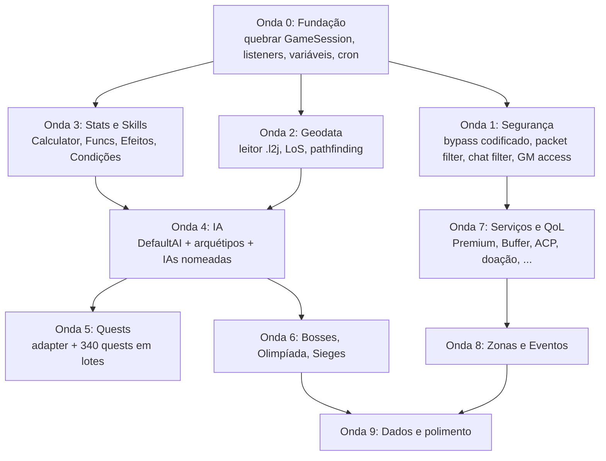

# Roteiro de Importação: L2JLucera2 → L2JLopez

> **Data:** 06/10/2026
> **Origem estudada:** `D:\Cristiano\Lineage\L2JLucera2\L2JLucera2` (Lucera2 Interlude, fonte reconstruída com Vineflower/CFR, Data estilo L2Reborn)
> **Destino:** `D:\Cristiano\Lineage\L2JLopez` (Java 21 + Spring Boot + Maven)
> **Método:** leitura direta do código, configs e datapack dos dois projetos. Os números abaixo foram medidos, não vêm do README do pacote.

---

## 1. Resumo executivo

O Lucera2 é uma base **muito mais profunda** que o L2JLopez em quase todos os sistemas de jogo. Ele não é derivado do L2JDream: é da linhagem russa **L2Phoenix / L2-Scripts / Rebellion** (pacotes `l2.gameserver`, `npc.model`, `services`, sistema de *listeners*, `Reflection`, `GlobalEvent` em XML, `Functions`/`ScriptFile`).

| Métrica | Lucera2 | L2JLopez |
|---|---|---|
| Arquivos Java | 2.565 (1.799 core + 766 scripts) | 293 |
| Linhas Java | 301.914 | 46.579 |
| Quests implementadas | **349** (+2 classes base) | 12 |
| Scripts de IA de NPC | **136** classes + 18 IAs base | 1 (`NpcAiService`, 645 linhas) |
| Classes de efeito de skill | 70 | — (efeitos dentro de `PlayerEffects`, 109 linhas) |
| Classes de tipo de skill | 58 | — |
| Condições de skill/item | 71 | `Conditions` (97 linhas) + `SkillCondition` (252) |
| Geodata / pathfinding | `GeoEngine` (61 KB) + `PathFind` + buffers | **ausente** (arquivos `.l2j` existem, mas nenhum código lê) |
| Comandos admin | 51 handlers (+8 em scripts) | dentro do `GameSession` |
| Voice commands | 21 | dentro do `GameSession` |
| Serviços NPC/CB | 77 classes em `services/` | parcial |
| Zonas com script | 14 tipos | 0 |
| Eventos | 28 classes | TvT/CTF/DM/PartyFarm/oficiais básicos |
| HTMLs (EN) | 16.368 | 4.363 (+10.868 em `scripts`) |

> [!IMPORTANT]
> **Choque de realidade sobre o L2JLopez.** O `ROTEIRO_MESTRE_SUPREMO` marca 118/118 subsistemas como "Concluído", mas vários são esqueletos: `AutoFarmService` tem 151 linhas (Lucera: 178 KB entre `AutoFarm.java`, `AutoFarmContext`, tasks e manager), `OlympiadManager` 192 linhas (Lucera: 162 KB no pacote `oly`), `FloodProtector.java` e `GeoEngine.java` citados no roteiro **não existem** no código. Além disso o `GameSession.java` tem **444 KB**, virou a nova "God Class". Este roteiro usa o Lucera como régua de profundidade real.

---

## 2. Aviso de origem e licença (ler antes de copiar qualquer coisa)

> [!CAUTION]
> O Lucera2 é um projeto **comercial e fechado** (lucera2.ru). Esta fonte é **descompilada**: os nomes privados estão ofuscados (`zY`, `bWf`, `a(...)`, `b(...)`), há marcas `Decompiled with CFR 0.152` e `WARNING - Removed try catching itself`. Copiar classes inteiras traz risco jurídico e código ilegível.

Regra adotada neste roteiro:
1. **Comportamento e regras de negócio**: estudar no Lucera e **reimplementar limpo** no padrão Spring do L2JLopez (records, `@Service`, eventos, testes).
2. **Dados** (XML de NPC, skills, spawns, multisell, HTML de quest): em grande parte vêm de PTS/L2J comunitário. Podem ser convertidos com ferramenta própria, revisando o que for claramente autoral do Lucera (GM Shop, NPCs 40012/40025, textos de serviço).
3. **Segredos encontrados no pacote**, nunca copiar: senha de banco `nexoral2j` em `login/config/authserver.properties`, chave do l2top.ru em `services.properties` (`key=ff31de3c...`), `PlayerID` fixo no `GMAccess.xml`.
4. **Código que não existe no pacote**: Phantoms (`fake.properties`, `data/phantoms/`) e AltRecBots (`altrecbots.properties`, tabelas `altrec_*`) têm config e dados, mas **nenhuma classe** no `java/` nem no `server.jar`/`scripts.jar`. Só os dados (frases, equipamento por classe) são reaproveitáveis.

---

## 3. Arquitetura do Lucera2: padrões que valem mais que qualquer feature

Antes das features, estes padrões resolvem problemas que o L2JLopez já tem (acoplamento no `GameSession`, sistemas que não conversam).

| # | Padrão Lucera | Onde | Por que trazer | Como fica no L2JLopez |
|---|---|---|---|---|
| A1 | **Listeners tipados por ator** (`OnDeathListener`, `OnKillListener`, `OnPlayerEnterListener`, `OnLevelUpListener`, `OnPvpPkKillListener`, `OnZoneEnterLeaveListener`, `OnEquipListener`, 35 interfaces em `listener/actor`) com listas globais e por instância | `l2/gameserver/listener/**`, `model/actor/listener/*ListenerList` | Toda feature (achievements, zonas, eventos, ACP) se pluga sem tocar no `Player` | `ApplicationEventPublisher` para eventos globais + `ListenerList` leve por ator no hot path (Spring fora do combate) |
| A2 | **Variáveis de personagem e de servidor** com expiração (`character_variables`, `server_variables`) | `CharacterVariablesDAO`, `ServerVariables`, `DeleteExpiredVarsTask` | Dezenas de features guardam estado sem criar tabela nova (cooldowns, toggles, contadores) | `PlayerVariables` / `ServerVariables` com cache + Flyway `V2xx` |
| A3 | **Cron nativo** (`SchedulingPattern`, suporta `~30:0` = janela aleatória) | `l2/commons/time/cron` | Respawn de épicos, eventos, zonas, restart, votos usam a mesma sintaxe | `CronExpression` do Spring + extensão para janela aleatória `~` |
| A4 | **Bypass codificado** (`BypassManager`): o servidor troca `bypass -h xxx` por um índice por sessão e rejeita bypass que não foi enviado | `instancemanager/BypassManager.java` | Elimina a classe inteira de exploits de bypass forjado (comprar item de NPC distante, teleporte grátis) | `BypassEncoder` por `GameSession`, aplicado em `NpcHtmlMessage` e `ShowBoard` |
| A5 | **Packet filter declarativo** (limite por pacote/ms, ações `log`, `actionFailed`, `drop`, `kick`) | `config/packetfilter.xml` (858 linhas), `network/pfilter` | Anti-flood e anti-bot sem código | `PacketRateLimiter` antes do dispatch, regras em YAML/XML |
| A6 | **Chat filter com lógica booleana** (canais, nível, tempo online, mapa, premium, flood, redirect, ban chat) | `config/chatfilters.xml`, `model/chat/chatfilter/matcher/*` (14 matchers) | Substitui o `WordFilterTable` simples | `ChatFilterChain` com matchers compostos |
| A7 | **Permissões GM granulares** (50+ flags: `CanBan`, `CanSeeHwid`, `UseGMShop`, `BlockInventory`...) por perfil | `config/GMAccess.xml`, `GMAccess.d/*.xml` (full, moderator, sheriff, marshal, event_manager) | Hoje o L2JLopez tem `access.properties` com níveis | `GmAccessProfile` record + checagem por comando |
| A8 | **Eventos/residências declarativos em XML** (`GlobalEvent` + ações `open/close door`, `spawn/despawn`, `announce`, `teleport_players`, `give_item`, `if/else`) | `data/events/siege/*.xml` (53), `model/entity/events/**` | Sieges de castelo, CH, duelos e barcos sem código por residência | Motor `EventTimeline` lendo XML, mesmo formato |
| A9 | **Reflection (instâncias)** com reuse por HWID, colapso, zonas próprias | `model/entity/Reflection`, `InstantZone`, `data/instances/*.xml` | Base para PvP instanciado, Frintezza, eventos isolados | `InstanceWorld` com `instanceId` no `GameWorld` |
| A10 | **Motor de stats** `Calculator` + `Func` (Add/Mul/Set/Sub/Div/Enchant) + `Env` + condições | `l2/gameserver/stats/**` | Base correta para buffs, sets, passivas, penalidades, mod de classe | Ver Onda 2 |
| A11 | **Ação adiada / recorder de status** (`PlayerStatsChangeRecorder`) envia só o que mudou | `model/actor/recorder` | Reduz tráfego de `UserInfo`/`StatusUpdate` | `StatsDirtyTracker` |
| A12 | **DbmsStructure** (sincroniza schema a partir de `gamed.json`) | `libs/dbmsstruct-1.0.jar` | Já resolvido no L2JLopez com Flyway | **Não trazer** |

---

## 4. Matriz de gap por área

Legenda: **Prioridade** P0 (bloqueia outras coisas) a P3 (cosmético). **Esforço** P (≤2 dias), M (≤1 semana), G (2-4 semanas), GG (>1 mês).

### 4.1 Núcleo de jogo

| Sistema | Lucera2 (referência) | L2JLopez hoje | Prio | Esforço |
|---|---|---|:-:|:-:|
| Geodata + LoS + pathfinding | `geodata/GeoEngine` (camadas, NSWE, `moveCheck`, `canSeeTarget`), `PathFind` A* com `PathFindBuffers` configuráveis, `GeoOptimizer` | Nada. Arquivos `data/geodata/*.l2j` (171) e `pathnode/*.pn` (167) sem leitor | **P0** | G |
| Motor de stats/fórmulas | `stats/Formulas` (37 KB), `StatFunctions` (31 KB), `Stats` enum, `Calculator`, `formulas.properties` (limites de P.Atk, crit, blow, dispel, modificadores de NPC/Raid/Epic) | `PlayerStats` (330 linhas), `StatFunc` (49) | **P0** | GG |
| Skills: efeitos e tipos | 70 efeitos (`skills/effects`), 58 tipos (`skills/skillclasses`), triggers (`stats/triggers`), `TimeStamp` de reuse, grupos de reuse compartilhado | `SkillService` (175), `SkillTemplate` (144) | **P0** | GG |
| Condições | 71 (`stats/conditions`): arma, alvo, zona, HP%, raça, classe, estado, item, nível... | `Conditions` + `SkillCondition` | P0 | G |
| IA de NPC | `DefaultAI` (56 KB) + `Fighter`, `Mystic`, `Priest`, `Ranger`, `Balanced`, `Guard`; 136 IAs nomeadas (bosses, Ketra/Varka, Isle of Prayer, residências, portas, rotas); `ai.properties` (tick, aggro, facção, pursue range, retorno com cura, exclusões de épicos) | `NpcAiService` único | **P0** | GG |
| Rotas de NPC | `data/superpointinfo` (131), `ai/moveroute/*`, `parsers/MoveRouteParser` | `NpcWalkerRoutesTable` (33 rotas) | P2 | M |
| Mundo / regiões | `World`, `WorldRegion`, `GameObjectsStorage` | `GameWorld` grid 4096 | — | ok |
| Itens / inventário | `ItemContainer`, `PcRefund`, `PcFreight`, listeners de item (sets, arco, augment, enchant options, skills) | `Inventory`, `InventoryService` | P1 | G |
| Enchant configurável por scroll | `data/enchant_items.xml` (65 KB): chance por nível, grade, tipo, ação na falha, limite por scroll | `EnchantScrollTable` | P1 | M |
| Augment (Life Stone) | `data/variation_data.xml` (962 KB), `variation_group.xml`, `optiondata/*` (165), `RefineryHandler` | `AugmentationService` | P1 | M |
| Itens extraíveis | `capsule_items.xml` (72 KB) | `ExtractableItemsTable` (341) | P2 | P |
| Karma / PK / drop de itens | `pvp.properties` (fórmula, itens não dropáveis, chance por PK, flag time) + `karma_increase` | parcial | P1 | M |
| Penalidades de EXP/drop | `other.properties`: deep blue drop rules, penalidade por diferença de nível, party penalty | parcial | P1 | P |

### 4.2 Conteúdo oficial

| Sistema | Lucera2 | L2JLopez | Prio | Esforço |
|---|---|---|:-:|:-:|
| **Quests** | 349 quests em `java/quests` (+`Bingo`, `SagasSuperclass`) + HTML em `html-en/quests/*` (tutoriais 201-206/255, 1ª/2ª classe completas 401-418 e 211-233, sagas 70-100, nobless 241-247, subclasse 234/235, bosses 337/348/618/641, clã 501-510, Ketra/Varka 605-616, reagentes 373-386, farm 600+) | 12 | **P0** | GG (mecânico) |
| Grand Bosses | `bosses/AntharasManager`, `ValakasManager`, `BaiumManager`, `SailrenManager`, `FrintezzaManager` (54 KB) + `instances/Frintezza` (31 KB) + IAs `Antharas`, `Valakas` (8 KB), `Baium`, `ZakenNightly`, `Orfen`, `Core`, `QueenAntNurse` | `GrandBossManager` (248), `FrintezzaService` (225) | P1 | G |
| Config de bosses | `bosses.properties`: respawn por intervalo ou **cron** (`~30:0 21 * * 6`), tempo de sono, limpeza de zona, tempo máximo, minions, anúncios, retorno de RB de zona de cidade/PvP, porta do Zaken por horário, teleporte do Orfen/Zaken | `config/main/bosses.properties` (DreamV2) | P1 | M |
| Raid Boss spawn/status | `RaidBossSpawnManager` (18 KB), `raidboss_status`, `raidboss_points` | `RaidPointsService` | P1 | M |
| Olimpíada | Pacote `entity/oly` (Competition, Controller, Hero, Nobles, Stadium pools; class-free, class-based, **team**), taxas de inscrição, checagem HWID/IP, classes proibidas, skills proibidas, reset de reuse no estádio, anúncio de sequência de vitórias (`OlyRampageService`), Hero Diary | `OlympiadManager` (192) | P1 | G |
| Seven Signs + Festival | `SevenSigns` (40 KB), `SevenSignsFestival` (19), `FestivalSpawn` (16), `SignsPriestInstance` (29), IAs SSQ (Lilith/Anakim) | `SevenSignsManager` (359) | P2 | G |
| Four Sepulchers | Pacote `instancemanager/sepulchers/**` (14 classes, orientado a eventos), `data/events/sepulchers/*` | `FourSepulchersService` | P2 | M |
| Dimensional Rift | `DimensionalRiftManager`, `data/dimensional_rift.xml` | `DimensionalRiftService` | P3 | P |
| Sieges de castelo/CH | `CastleSiegeEvent` (23 KB), `ClanHallSiegeEvent`, `ClanHallMiniGameEvent` (Rainbow Springs), `ClanHallTeamBattleEvent`, `ClanHallNpcSiegeEvent`, `ClanHallAuctionEvent`; 53 XML de residência | `SiegeService` (344), `ClanHallSiegeService` (221) | P1 | G |
| Castelo: upgrades | `castle_door_upgrade`, `castle_damage_zones`, `castle_hired_guards`, `ChamberlainInstance` (31 KB) | parcial | P2 | M |
| Manor | `CastleManorManager` (14 KB), `seeds.csv`, `ManorManagerInstance` | `CastleManorManager` | P3 | P |
| Pet evolve / Wyvern | `services/petevolve/*`, `WyvernManagerInstance`, `RideHire` | parcial | P3 | P |
| Newbie Guide completo | `NewbieGuideInstance` (85 KB), `html-en/newbiehelper/*` por raça | `NewbieHelperService` | P2 | M |
| Village Master | `services/villagemasters/Occupation.java` (80 KB): troca de classe, subclasse, clã, aliança | dentro do `GameSession` | P1 | M |

### 4.3 Serviços, QoL e economia (o "diferencial" do Lucera)

| Sistema | Lucera2 | L2JLopez | Prio | Esforço |
|---|---|---|:-:|:-:|
| **Premium Account (Rate Bonus)** | `services/RateBonus`, `config/services_rate_bonus.xml`: perfis com multiplicador de exp, sp, exp/sp de raid, quest reward, quest adena, quest drop, drop adena, drop item, drop raid, spoil, **multiplicador de enchant**, dias, limite por HWID, cor de nome, recompensa extra; `.pa`; aviso de expiração no login; `accounts_bonuses` | nada | **P1** | M |
| **Buffer com esquemas** | `services/Buffer.java` (27 KB) + `data/buff_templates.xml` (60 KB): templates, perfis salvos por personagem, buff de pet, cura, cancel, reuse compartilhado, custo, bloqueio em combate/olimpíada | `_bbsbuff_` simples no CB | **P1** | M |
| **ACP (auto poção)** | `services/ACP.java`: `.acp hp 50`, faixas min/max, itens por tipo, só premium opcional, desativado em zona de paz | nada | P1 | P |
| AutoFarm completo | `voicecommands/impl/AutoFarm.java` (93 KB), `AutoFarmContext` (52 KB), tasks por arquétipo (Physical, Archer, Magic, Heal, Summon), `auto_farm.properties`: preço por horas, trial, limite por HWID, raio, delays, zonas proibidas, mobs ignorados, anel vermelho | `AutoFarmService` (151 linhas) | P1 | G |
| Class Master | `ClassMasterInstance`, `MultiClassMasterInstance`, `CommandClassMaster` (19 KB), voice `.class`/`.prof` com **popup ao ganhar EXP**, preço e recompensa por profissão | parcial (`nomore.htm`) | P1 | M |
| Serviços de personagem | `services/*`: Rename, ChangeSex, NickColor, TitleColor, KarmaClean, PKClean, Delevel, Levelup, ResetLevelService, ChangeBaseClass, SubClassSeparate, NoblesSell, HeroSell (por dias), OlympiadPointsReset, Expand Inventory/Warehouse/CWH, TransferAugment, VariationSellService | parcial | P1 | M (cada um P) |
| Serviços de clã | ClanRename, ClanUpgrade, ClanSkillSell, ClanReputationSell, item de reputação, **ClanHelperService** (bônus por N membros online sem HWID repetido), **ClanBuffService** (buff escalonado por online), `.summon_clan` | parcial | P2 | M |
| **PawnShop (casa de penhores/leilão)** | `services/pawnshop/PawnShop.java` (44 KB): classes de item, moedas, taxa, grade mínima, enchant mínimo, itens proibidos, busca textual, paginação | nada | P2 | M |
| **ItemBroker** | `services/ItemBroker.java` (50 KB): busca de lojas privadas por item (venda/compra/craft) no Adventure Guildsman | nada | P2 | M |
| Appearance Stone / Skin | `handler/items/Appearance.java`, `services/ItemFakeAppearance` + `data/item_fake_appearance.xml` | `DressMeService` | P2 | M |
| Promo codes | `PromoCodeService`, `promocodes.xml`: janela de data, recompensas (item, exp, sp, level, premium), limite por usuário/IP/HWID; `.promo` | nada | P2 | P |
| Entrega de doação | `DelayedItemsManager` + `items_delayed` (o site insere, o jogo entrega online) | nada | **P1** | P |
| Votação | `L2JBrazilService` (**útil para servidor BR**), `L2TopZoneService`, `L2HopZoneService`, `MMOTopVote`, `L2TopRuManager` | `vote.properties` herdado | P2 | M |
| Banking | `.deposit`/`.withdraw` adena ↔ gold bar | nada | P3 | P |
| Status de bosses | `.epic` / `.boss_status`, `.raid` / `.rb` com formato de data | `BossStatus` parcial | P2 | P |
| Rankings | `TopPvPPKService`, `TopClanService` (pontos custom por castelo/raid/hero) | `_bbsranking` | P3 | P |
| Lottery / Roulette | `LotteryManager`, `services/Roulette` (martingale limitado) | `LotteryService`, `RouletteService` | — | ok |
| Offline trade | `.offline`, restaurar após restart, zona offshore, cor/efeito, taxa, dias para kick, raio mínimo entre lojas | `OfflineTradeService` | P2 | P |
| NoCarrier | personagem fica X segundos no mundo após queda de conexão, título "DISCONNECTED", proteção opcional | nada | P2 | P |
| Wear / Jail / Feather | preço de wear por grade, coordenadas da jail, Feather of Blessing | parcial | P3 | P |
| Stat mod por classe | `services/StatModifier` + `stats_custom_mod.xml`: bônus por classe, por classe-alvo, por item equipado (**balanceamento de classes sem recompilar**) | nada | **P1** | M |
| Spoil configurável | `spoil.properties`: rate por item, chance mínima, manor | parcial | P3 | P |

### 4.4 Community Board

| Sistema | Lucera2 | L2JLopez | Prio | Esforço |
|---|---|---|:-:|:-:|
| Teleporte com favoritos | `CommunityTeleport` (`_bbsteleport_save/delete/teleport`), `bbs_comteleport`, custo, limite, só premium, zonas proibidas | `_bbsteleport` fixo | P2 | P |
| Gabinete pessoal | `CbPersonalCabinet`: **troca de senha da conta** pelo jogo (via `IGPwdCng` ao login), repair, estatísticas | `_bbsrepair` | P2 | P |
| Serviços via CB | `CommunityServices`: delevel, noble, sexo, nome, venda, level de clã | nada | P2 | P |
| Class master via CB | `pvpcommunityboard.properties` | nada | P2 | P |
| Augment via CB | `_bbssaugmentation`, `_bbssaugmentcancel` | nada | P3 | P |
| Quests via CB | `CommunityQuests` | nada | P3 | P |
| CB original | `ClanCommunity`, `RegionCommunity`, `ManageFriends`, `ManageMemo`, `ManageFavorites`, `PrivateMail` | parcial | P3 | M |
| Trava de estado | `AllowBBSAbnormal`: bloqueia CB morto, em olimpíada, voando, atacando | ? | P1 | P |

### 4.5 Zonas com comportamento (parametrizadas por XML)

Todas são ativadas por parâmetros no XML da zona, sem código por zona. Excelente para servidor custom.

| Zona | Parâmetros | Prio |
|---|---|:-:|
| `KillRewardZone` | `playerKillReward`, `karmaPlayerKillReward`, `playerKillCheck` (ip/hwid), intervalo | P1 |
| `AutoBuffZone` | lista de buffs por predicado (mago/guerreiro), reaplicação | P2 |
| `HwidLimitedZone` / `IpLimitedZone` | `uniqHwidLimit`, local de retorno | P1 |
| `CronZoneSwitcher` | liga/desliga zona por cron, anúncio, eventos de spawn | P2 |
| `LevelLimitZone`, `ClassIdLimitZone` | faixa de nível, classes | P2 |
| `ProhibitSkillsZone`, `ItemProhibitZone` | skills/itens bloqueados | P2 |
| `NoPartyZone`, `RemoveBuffZone` | sem party, remove buffs ao entrar | P2 |
| `CapacityRestrictZone`, `ClanCapacityRestrictZone`, `ClanLimitSiegeZone` | limite de jogadores/clã | P3 |
| Limite de enchant por zona | `EnchantLimitZoneNames` + limites por tipo (épicos) | P1 |

### 4.6 Eventos

| Evento | Lucera2 | L2JLopez | Prio |
|---|---|---|:-:|
| **PvPEvent unificado** | `events/TvT2/PvPEvent.java` (103 KB): TvT, CTF e DM com **rotação de regra**, instâncias 801-804, estado persistido em `ServerVariables`, buffs por arquétipo, skills e enchant restritos, `//pvpevent` | 3 serviços separados (TvT/CTF/DM) | P1 |
| TvT Arena | `TvTTemplate` + 3 arenas | — | P3 |
| Last Hero | `events/lastHero` (25 KB), todos contra todos em zona, a cada hora | — | P2 |
| GvG (party vs party) | `events/GvG` + instância 504, faixa de nível, tamanho mínimo de party | — | P2 |
| Drop event por config | `DropEvent_Items = 4037-5(100)<1-20>;...`, drop de party, rated, HWID | `EventDropEntry` | P2 |
| Sazonais | Christmas, Halloween (fantasmas voando que dropam), TheFallHarvest, L2Day, Heart, Glittering Medal, CofferOfShadows, TrickOfTrans, SavingSnowman, March8, Finder (refém), StraightHands (desliga itens de doação no dia) | Squash, Natal, L2Day | P3 |
| Duelos | `PlayerVsPlayerDuelEvent`, `PartyVsPartyDuelEvent` com snapshot | ? | P2 |

### 4.7 Segurança, operação e login

| Sistema | Lucera2 | L2JLopez | Prio | Esforço |
|---|---|---|:-:|:-:|
| Bypass codificado | A4 acima | nada | **P0** | M |
| Packet filter | A5 acima | nada (o roteiro cita `FloodProtector`, mas não existe) | **P0** | M |
| Captcha anti-bot | `BotCheckService`, `CapchaUtil` (imagem), captcha ao pegar quest, penalidade por skill | `BotsPreventionService` (botões) | P2 | M |
| AutoBan | `utils/AutoBan` | ? | P2 | P |
| Ban de HWID | `aacg_hwid_bans`, limites por HWID em premium/autofarm/zonas/olimpíada | nada; **depende de proteção no cliente** | P2 | M |
| Login: hash moderno | `PasswordHash = whirlpool2` + `LegacyPasswordHash = sha1` (migra no login) | `LegacyPasswordHasher` | P1 | P |
| Login: anti brute-force | `LoginTryBeforeBan`, `LoginTryTimeout`, `IpBanTime`, white/black list | ? | P1 | P |
| Login: proxy servers | `proxyservers.xml` (mesmo GS anunciado em vários IPs, `hideMain`, `minAccessLevel`) | nada | P3 | P |
| HAProxy v2 | `HAProxyLoginserverPort` | nada | P3 | P |
| Auto restart por cron | `AutoRestartAt` | nada | P2 | P |
| Backup de banco | `DatabaseDumpTables`, zip | nada | P3 | P |
| Telnet admin | `network/telnet/*` (status, perf, ban, say, items, world) | Actuator/REST | **Não trazer** (substituir por endpoints REST protegidos) | — |
| Segunda senha | `second_auth.sql` | nada | P3 | M |
| Logs de auditoria | `utils/Log` (item log, debug de bypass) | ? | P2 | P |

### 4.8 Dados (datapack)

| Recurso | Lucera2 | Observação |
|---|---|---|
| NPCs | `data/npc/*.xml` (88 arquivos por faixa de ID), com parâmetros de IA por NPC | conversor para o formato do L2JLopez ou leitor novo |
| Itens | `data/items/*.xml` (101) | idem |
| Skills | `data/stats/skills` (60 arquivos) | depende da Onda 2 (efeitos/condições) |
| Templates de jogador | `data/stats/player` (184) | stats por classe/nível estilo PTS |
| Spawns | `data/spawn/*.xml` (102, por região de mapa) | substitui tabelas `spawnlist` |
| Skill trees | `data/skill_tree/*` (normal, fishing, hero, nobles, pledge, clan leader, enchant) | |
| Multisell | 158 arquivos + `gm_shop.xml` (250 KB) | GM Shop por grade já pronto |
| Buy lists | `merchant_buylists.xml` (682 KB), `clanhalls_buylists.xml` | |
| Receitas | `recipe.xml` (700 KB) | |
| HTML | `html-en` 16.368, `html-ru` 13.749 | quests em formato PTS (`ein_q0401_04.htm`) |
| Henna, peixes, cubics, armor sets, soul crystals, static objects, portas (50), zonas (20), regiões (4), barcos | XML | |
| Geodata | `game/geodata/*.l2g` (166) | **mesmo conteúdo do `.l2j` com XOR e 4 bytes de cabeçalho**. O L2JLopez já tem os `.l2j`: não precisa importar, só o leitor |

---

## 5. Roteiro em ondas

Cada onda termina com o servidor subindo, um cliente entrando e os testes verdes (regra já adotada no projeto).

### Onda 0: Fundação (pré-requisito de tudo)

| # | Entrega | Referência Lucera | Critério de pronto |
|---|---|---|---|
| 0.1 | Quebrar o `GameSession` (444 KB) em handlers: `AdminCommandHandler` por comando, `VoicedCommandHandler`, `BypassHandler`, `UserCommandHandler`, `ItemHandler`, `CommunityBoardHandler` registrados como beans | `handler/**` (registries) | `GameSession` < 60 KB, só sessão e dispatch |
| 0.2 | Listeners por ator (A1): morte, kill, PvP/PK, level up, entrar/sair do mundo, entrar/sair de zona, equipar, teleporte, ganho de exp/sp | `listener/**` | Achievements e Quake migrados para listeners |
| 0.3 | Serviço `PlayerVariables` (tabela `character_variables` já existe, V49) e `ServerVariables` (tabela nova) com expiração | `CharacterVariablesDAO`, `ServerVariables` | Flyway + teste |
| 0.4 | Cron com janela aleatória `~` | `SchedulingPattern` | Testes com `~30:0 21 * * 6` |
| 0.5 | `ItemLog`/auditoria de transações | `utils/Log` | Log de trade, drop, enchant, compra |

### Onda 1: Segurança de protocolo

| # | Entrega | Referência | Critério |
|---|---|---|---|
| 1.1 | Bypass codificado por sessão (normal e BBS) com lista de bypass simples permitidos | `BypassManager` | Bypass forjado é rejeitado e logado |
| 1.2 | Packet filter por XML/YAML (count/perMs, ações) | `packetfilter.xml`, `network/pfilter` | Spam de `AttackRequest`/`RequestEnchantItem` contido |
| 1.3 | Chat filter composto (substitui `WordFilterTable`) | `chatfilters.xml` | Flood, nível, redirect WTS→Trade, ban chat |
| 1.4 | Perfis de GM granulares | `GMAccess.xml`, `GMAccess.d` | Moderador não usa `//item` |
| 1.5 | Login: whirlpool2 com migração de sha1, anti brute-force por IP | `authserver.properties` | Conta antiga loga e é migrada |
| 1.6 | NoCarrier (permanência após desconexão) | `services.properties` `NoCarrier*` | Teste de queda de socket |

### Onda 2: Geodata e movimento

| # | Entrega | Referência | Critério |
|---|---|---|---|
| 2.1 | Leitor dos `.l2j` existentes (flat/complex/multilayer, NSWE) com memória mapeada | `GeoEngine` | `getHeight` correto em 10 pontos conhecidos |
| 2.2 | `canSeeTarget` (LoS) em skills, ataques à distância e aggro | `GeoEngine` | Mago não acerta através de parede |
| 2.3 | `moveCheck` com colisão e queda | `GeoMove` | Não atravessar muralha de castelo |
| 2.4 | Pathfinding A* com buffers e limite de tempo | `PathFind`, `PathFindBuffers`, `geodata.properties` | NPC contorna obstáculo; p99 < 5 ms |
| 2.5 | Decidir descarte de `pathnode/*.pn` | — | Remover se o A* atender |

### Onda 3: Stats, skills e fórmulas (maior ganho de fidelidade)

| # | Entrega | Referência | Critério |
|---|---|---|---|
| 3.1 | `Calculator` por stat + `Func` (add/mul/set/sub/div/enchant) com ordem e dono | `stats/Calculator`, `stats/funcs` | Buff + set + passiva somam igual ao retail |
| 3.2 | Fórmulas completas e limites configuráveis | `Formulas`, `StatFunctions`, `formulas.properties` | Testes de caracterização com valores do Lucera |
| 3.3 | Condições (71) como predicados compostos | `stats/conditions` | Parser XML de condições |
| 3.4 | Efeitos (70) e tipos de skill (58), triggers, reuse compartilhado | `skills/effects`, `skills/skillclasses`, `stats/triggers` | Todas as skills de 1 classe por vez (começar Gladiator, Archmage, Bishop) |
| 3.5 | Modificador de stats por classe/alvo/item | `StatModifier`, `stats_custom_mod.xml` | Balanceamento via XML com reload |
| 3.6 | Limites de enchant em olimpíada, eventos e zonas | `olympiad.properties`, `events.properties`, `services.properties` | Item +20 vira +6 efetivo na zona |

### Onda 4: Inteligência artificial

| # | Entrega | Referência | Critério |
|---|---|---|---|
| 4.1 | `DefaultAI` com intenções (idle, active, attack, cast, follow, return home), hate list, facção, random walk, retorno com cura | `ai/DefaultAI`, `ai.properties` | Mob volta e cura; épico não cura |
| 4.2 | Arquétipos: Fighter, Mystic, Priest, Ranger, Balanced, Guard | `ai/*.java` | Priest cura aliado, Ranger mantém distância |
| 4.3 | Parâmetros de IA por NPC no XML do template | `data/npc/*.xml` | `ai="Fighter"` + params |
| 4.4 | IAs nomeadas por prioridade: bosses (Antharas, Valakas, Baium, Zaken, Orfen, Core, QA), Ketra/Varka, Isle of Prayer, SSQ, residências, portas | `ai/**` (136) | Um teste por IA de boss |
| 4.5 | Minions com respawn configurável | `MinionList`, `AllMinionsRespawnInterval` | |

### Onda 5: Quests em massa

O formato das quests do Lucera é praticamente o mesmo do L2JLopez (`addStartNpc`, `addTalkId`, `addKillId`, `onEvent`, `onTalk`, `onKill`, `QuestState.giveItems/takeItems/setCond/playSound`). O porte é mecânico.

| # | Entrega | Critério |
|---|---|---|
| 5.1 | Adapter de API: `onEvent(String, QuestState, NpcInstance)`, `onTalk(NpcInstance, QuestState)`, `onKill`, `addQuestItem`, `QuestRates` (`quest_rates.properties`, 20 KB) | 1 quest do Lucera roda sem mudar a lógica |
| 5.2 | Importar HTML de `html-en/quests/<quest>` junto com cada quest | `HtmCache` resolve nome PTS |
| 5.3 | Lote A: tutoriais (201-206, 255) e 1ª classe (401-418) | Todas as raças trocam de classe |
| 5.4 | Lote B: 2ª classe (211-233) e subclasse/nobless (234, 235, 241, 242, 246, 247) | |
| 5.5 | Lote C: sagas de 3ª classe (70-100, base `SagasSuperclass`) | |
| 5.6 | Lote D: acesso a bosses (337, 348, 618, 641), clã (501-510), Ketra/Varka (605-616) | |
| 5.7 | Lote E: reagentes e farm (370-386, 600-688), 1-171, 257-386 restantes | 340 quests |
| 5.8 | Captcha ao pegar quest (opcional) | `QuestCaptchaCheck` |

### Onda 6: Bosses, olimpíada e sieges

| # | Entrega | Referência |
|---|---|---|
| 6.1 | Managers de épicos com estados (`EpicBossState`), respawn por cron, sono, limpeza de zona, tempo máximo, anúncios | `bosses/*`, `bosses.properties` |
| 6.2 | Instância de Frintezza (CC mínimo/máximo, distância de entrada, tempo de tumba) | `instances/Frintezza`, `FrintezzaManager` |
| 6.3 | `RaidBossSpawnManager` + `.raid`/`.epic` + pontos de raid | `RaidBossSpawnManager`, `BossStatusService` |
| 6.4 | Olimpíada completa (3 tipos, pools, estádios, taxas, HWID/IP, anúncio de sequência, Hero Diary) | `entity/oly/**`, `olympiad.properties` |
| 6.5 | Motor de eventos XML (A8) e sieges de castelo/CH declarativas, incluindo Rainbow Springs e Wild Beast Reserve | `entity/events/**`, `data/events/siege/*` |
| 6.6 | Instâncias (A9) | `Reflection`, `InstantZone` |

### Onda 7: Serviços e QoL (o que o jogador vê primeiro)

Ordem sugerida por relação valor/esforço:

1. **Entrega de doação** (`items_delayed`) + endpoint REST para o site inserir.
2. **Premium Account** com `services_rate_bonus.xml`, `.pa`, aviso de expiração.
3. **ACP** (`.acp`).
4. **Buffer com esquemas** (`buff_templates.xml`) no NPC e no CB.
5. **Class Master** com popup por EXP e preços configuráveis.
6. **NPC de serviços** (nome, sexo, cores, karma, PK, clã, noblesse, hero por dias, expansões).
7. **Promo codes** (`.promo`).
8. **AutoFarm completo** (arquétipos, preço/tempo, trial, HWID, zonas proibidas).
9. **CB**: teleporte com favoritos, gabinete (troca de senha), serviços, augment.
10. **PawnShop** e **ItemBroker**.
11. Appearance stone, transfer augment, venda de augment, subclass separate, change base class.
12. Votação **L2JBrazil** (prioridade no Brasil), TopZone, HopZone.
13. Banking, `.online` com multiplicador, `.whoami`, `.relocate`, `.relog`, `.cfg`, `.ping`, `.serverinfo`.

### Onda 8: Zonas e eventos

1. Zonas parametrizadas (4.5), começando por `KillRewardZone`, `HwidLimitedZone`, limite de enchant por zona.
2. **PvPEvent unificado** substituindo os 3 serviços atuais, com rotação TvT→CTF→DM e instâncias.
3. Last Hero, GvG, Drop event por config.
4. Sazonais (Halloween, Christmas, etc.) conforme calendário.

### Onda 9: Dados e polimento

1. Conversores: NPC, item, spawn, skill XML do Lucera → formato do L2JLopez (ou leitor nativo). Testes de contagem.
2. GM Shop (`gm_shop.xml`) e multisells por grade.
3. `formulas.properties` → record tipado.
4. Configs de PvP (karma, drop por PK, flag time, contagem por zona) e `other.properties` (penalidades de EXP/drop, slots, enchant max, efeitos de enchant).
5. Mensagens por idioma (`CustomMessage`, EN/RU → EN/PT-BR).

---

## 6. Top 15 ganhos rápidos

| # | Item | Por quê | Esforço |
|---|---|---|:-:|
| 1 | Entrega de doação (`items_delayed`) | Monetização sem GM online | P |
| 2 | Bypass codificado | Fecha exploits de bypass | M |
| 3 | Packet filter | Anti-flood real | M |
| 4 | Premium Account | Receita + QoL | M |
| 5 | ACP | Pedido nº 1 de jogadores | P |
| 6 | Buffer com esquemas | Padrão em servidor custom | M |
| 7 | Stat mod por classe (XML) | Balanceamento sem recompilar | M |
| 8 | Promo codes | Marketing | P |
| 9 | Class master com popup | Onboarding | P |
| 10 | `.epic` / `.raid` | Engajamento | P |
| 11 | NoCarrier | Evita morte por queda de conexão | P |
| 12 | Respawn de épicos por cron | Agenda fixa (Antharas sáb 21:30 etc.) | P |
| 13 | `KillRewardZone` | Zona PvP com recompensa | P |
| 14 | Teleporte com favoritos no CB | QoL | P |
| 15 | Login whirlpool2 + anti brute-force | Segurança | P |

---

## 7. O que NÃO trazer

| Item | Motivo |
|---|---|
| Phantoms / AltRecBots | Código ausente no pacote. Só os dados servem, se um dia houver motor próprio de bots |
| Telnet | Inseguro; o L2JLopez já tem Actuator e REST |
| `dbmsstruct` / stored procedures `lip_ex_*` | Flyway já cobre |
| Kamaloka, Freya, Delusion Chamber, item auction, attribute bonus, Kamael (`_127_Kamael...`) | Fora do Interlude ou vestígio de crônicas posteriores |
| Votos russos (l2top.ru, mmotop) | Sem público no Brasil |
| `PcCafePointsExchange` | Sistema coreano/russo sem uso aqui |
| `ArabicConv`, `translit*.txt` | Sem uso |
| Estilo do código (nomes ofuscados, singletons estáticos, `Functions` com reflexão) | Reimplementar no padrão Spring |
| HTMLs duplicados de teste (`40025 - Copia.htm`, `40025 2.htm`) | Lixo do pacote |

---

## 8. Riscos e dependências

1. **IDs custom e patch de cliente.** Os serviços usam o item `9300` como moeda de doação e NPCs `40012`/`40025`. Isso exige o `LuceraTestPatch.7z` (31 MB) ou equivalente no cliente. Antes de importar serviços, decidir a moeda de doação do L2JLopez e conferir os `.dat` do patch L2jEder.
2. **HWID** só existe com proteção no cliente (o Lucera espera uma). Sem ela, usar IP como fallback, como o próprio Lucera faz (`AllowCheckHwidLimits`).
3. **Fidelidade de fórmula.** Ao trocar o motor de stats (Onda 3), qualquer valor muda. Fazer testes de caracterização com números extraídos do Lucera antes de trocar.
4. **Performance.** Listeners e IA no hot path devem ser POJOs, sem proxy do Spring.
5. **Formato de HTML.** Quests do Lucera usam nomes PTS (`ein_q0401_04.htm`), diferentes dos do DreamV2 (`30010-01.htm`). Importar quest e HTML juntos, por pasta.
6. **Roteiro mestre desatualizado.** Recomendo revisar o `ROTEIRO_MESTRE_SUPREMO` trocando "Concluído" por "Esqueleto" onde a profundidade não bate (AutoFarm, Olimpíada, Geodata, FloodProtector, IA, skills).

---

## 9. Anexo: inventário do Lucera2

### 9.1 Voice commands (`handler/voicecommands/impl`)
`Augments`, `AutoFarm`, `Banking`, `Cfg`, `CWHPrivileges`, `Debug`, `Help`, `InstanceZone`, `ItemRemaining`, `Mammon`, `Offline`, `Online`, `Ping`, `Relocate`, `Relog`, `ServerInfo`, `Services`, `Wedding`, `WhoAmI` + nos serviços: `.acp`, `.pa`, `.promo`, `.epic`, `.raid`, `.class`, `.deposit`, `.withdraw`, `.summon_clan`, votos.

### 9.2 Comandos admin (`handler/admincommands/impl` + scripts)
`AdminAdmin`, `Announcements`, `Ban`, `Camera`, `Cancel`, `ChangeAccessLevel`, `ClanHall`, `CreateItem`, `CursedWeapons`, `Delete`, `Disconnect`, `DoorControl`, `EditChar` (61 KB), `Effects`, `Enchant`, `Events`, `Geodata`, `Gm`, `GmChat`, `Heal`, `HelpPage`, `Instance`, `IP`, `Kill`, `Level`, `Mammon`, `Manor`, `Menu`, `MonsterRace`, `Move`, `Nochannel`, `Olympiad`, `Petition`, `Pledge`, `Polymorph`, `Quests`, `Reload`, `RepairChar`, `Res`, `Ride`, `Scripts`, `Server`, `Shop`, `Shutdown`, `Skill`, `Spawn`, `SS`, `Target`, `Teleport`, `Test`, `Zone`, `BossStatus`, `ClientSupport`, `GlobalEvent`, `PvPEvent`, `Residence`, `Team`, `TeleportBookmark`.

### 9.3 Arquivos de configuração
`ai`, `altrecbots`, `altsettings` (25 KB), `auto_farm`, `bosses`, `chatfilters.xml`, `clan`, `custom`, `events`, `fake`, `formulas`, `geodata`, `GMAccess.xml` + `GMAccess.d`, `olympiad`, `other`, `packetfilter.xml`, `pvp`, `pvpcommunityboard`, `quest_rates`, `residence`, `server`, `services` (26 KB, 718 linhas), `services_rate_bonus.xml`, `spoil`, `telnet`, `autoannounce.xml`, `experience.csv`.

### 9.4 Tabelas de banco que não existem no L2JLopez
`accounts_bonuses`, `aacg_hwid_bans`, `bbs_comteleport`, `bbs_favorites`, `bbs_mail`, `bbs_memo`, `bbs_clannotice`, `character_group_reuse`, `character_instances`, `character_post_friends`, `character_premium_items`, `ex_achievements`, `instances_hwid_reuse`, `items_delayed`, `pawnshop`, `promocodes` (+ limites por IP/HWID/usuário), `raidboss_points`, `second_auth`, `server_variables`, `variation_sell_service_template`, `l2jbrazil_votes`, `l2topzone_votes`, `l2hopzone_votes`, `oly_comps`, `oly_season`, `heroes_diary`, `castle_damage_zones`, `castle_door_upgrade`, `castle_hired_guards`, `epic_boss_spawn`.

> [!NOTE]
> `character_variables` já existe no L2JLopez (`V49__character_variables.sql`), mas nenhuma classe Java lê ou grava nela. A Onda 0.3 só precisa do serviço.

### 9.5 Quests por faixa (349 + 2 bases)
| Faixa | Qtde | Conteúdo |
|---|---|---|
| 1-53 | 50 | Iniciais, viagens entre cidades, iscas de pesca, Hellmann |
| 70-100 | 31 | Sagas de 3ª classe |
| 101-171 | 48 | Quests de nível baixo/médio, Primeval Isle, Pavel, Elroki |
| 201-255 | 36 | Tutoriais, 2ª classe, Fate's Whisper, Mimir, Nobless, Tutorial |
| 257-386 | 92 | Repetíveis de farm, reagentes, Giant's Cave, Ivory Tower |
| 401-432 | 25 | 1ª classe, pets, casamento, pesca |
| 501-510 | 6 | Clã |
| 601-688 | 60 | Ketra/Varka, Sepulchers, Rift, Sailren, Frintezza, farm de endgame |
| 1103 | 1 | `_1103_OracleTeleport` |
| Bases (sem número) | 2 | `Bingo`, `SagasSuperclass` |
