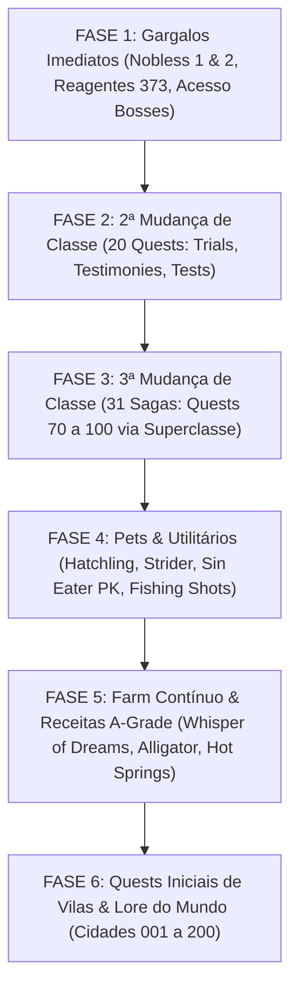

# Roteiro Mestre de Migração de 100% das Quests — L2JLopez (Java 21 LTS)

> **Documento Estratégico de Migração Completa e Paridade com Retail Interlude (C6)**  
> **Fontes Canônicas de Referência**: `L2JLucera2` (Java nativo de alta performance) e `L2JDreamV2` (Jython / Datapack)  
> **Runtime Alvo**: Java 21 LTS, Spring Boot 3.5, Virtual Threads (Project Loom), Componentes Nativos `@Component`  
> **Status**: Em Execução Ativa — Ambiente de Desenvolvimento

---

## 1. Visão Geral e Situação Atual

No Lineage II Interlude (Chronicle 6), o universo oficial de missões abrange entre **343 e 351 quests**.  
No **L2JLopez**, optamos por não rodar um interpretador Python/Jython em runtime devido ao alto consumo de memória, overhead de compilação em boot e degradação de throughput sob carga. Todas as quests rodam como componentes Java nativos gerenciados pelo Spring Framework.

### O Placar Atual:
* **Quests Implementadas Nativamente em Java**: `37 quests` (100% testadas e operacionais).
* **Quests Pendentes de Migração**: `~306 quests` (já presentes em `data/scripts/quests/` como HTMLs e scripts legados, aguardando conversão para componentes Java).

---

## 2. Matriz de Progresso e O Que Já Está Pronto (37 Quests)

| Categoria | Total no Jogo | Implementadas em Java | Status | Detalhes |
|---|:---:|:---:|:---:|---|
| **Tutorial & Starter** | 1 | 1 | 100% | `Quest 255: Tutorial` com Newbie Helpers das 5 raças |
| **1ª Mudança de Classe** | 18 | 18 | 100% | Quests 401 a 418 completas para todas as raças |
| **2ª Mudança de Classe** | 23 | 3 | 13% | 211 (Challenger), 212 (Duty), 217 (Trust) |
| **Subclasse** | 2 | 2 | 100% | 234 (Fate's Whisper) e 235 (Mimir's Elixir) |
| **Noblesse** | 4 | 2 | 50% | 246 (Possessor Part 3) e 247 (Possessor Part 4) |
| **Grand Boss Access** | 5 | 4 | 80% | 337 (Antharas), 348 (Baium), 618 (Valakas), 119 (Frintezza) |
| **Progressão de Clã** | 2 | 2 | 100% | 501 (Clan Lv 4) e 503 (Clan Lv 5) |
| **Endgame Farm & Alliances**| 6 | 5 | 83% | 350 (Soul Crystals), 605 (Ketra), 611 (Varka), 617 (FotG), 619 (IT) |
| **3ª Classe (Sagas)** | 31 | 0 | 0% | Nenhuma implementada ainda em Java |
| **Dungeons & Secundárias** | ~250 | 0 | 0% | Quests de vilas, pets, fishing e farm secundário |

---

## 3. Roteiro Sequencial de Migração (Fases 1 a 6)

Como o servidor está em fase fechada de desenvolvimento e a meta é **migrar 100% das quests**, a execução está organizada em fases de impacto decrescente: da espinha dorsal competitiva (Nobless, Subclasse, Dungeons) até as quests secundárias de vilarejo.

---

### FASE 1: Fechamento dos Gargalos Imediatos de Progressão

#### Lote 1.1: Conclusão da Trilha de Nobless (Quests 241 e 242)
* **Objetivo**: Fechar o ciclo contínuo das 4 partes de Nobless (`241` ➔ `242` ➔ `246` ➔ `247`).
* [ ] **Quest 241: Possessor of a Precious Soul - Part 1**
  * *NPC Inicial*: Talien (Rune Castle Town).
  * *Etapas*: Gabrielle (Giran), Gilmore (DVC), Malruk Succubus (DVC - 10 Malruk Succubus Teeth), Kantabilon (Dion), Echo Crystal, Stakato Queen (Cruma Marshlands), Poetry Book.
  * *Recompensa*: Caradine Letter (Parte 2).
* [ ] **Quest 242: Possessor of a Precious Soul - Part 2**
  * *NPC Inicial*: Virgil (Rune Castle Town).
  * *Etapas*: Kassandra, Ogmar, Mysterious Dark Knight (Swamp of Screams), Witch Kalis (Ivory Tower), Alchemist Matild, caveira do Cavaleiro Negro, entrega do Pure Silver.
  * *Recompensa*: Caradine Letter (Parte 3).

#### Lote 1.2: Alquimia da Subclasse & Reagentes (Quest 373)
* **Objetivo**: Habilitar a produção de Pure Silver, True Gold e Reagentes para a Quest 235 (Mimir's Elixir) e poções de buff.
* [ ] **Quest 373: Supplier of Reagents**
  * *NPC Inicial*: Trader Wesley (Subsolo de Ivory Tower).
  * *Mecânica Especial*: Urna Alquímica (*Alchemist's Mixing Urn*). Sistema de mistura com 3 temperaturas (Salamander, Ifrit, Phoenix) e chances de sucesso/falha de reagentes.
  * *Fórmulas*: Moonstone Dross + Volcano Ash = Moondust; 10 Moondust + Quick Silver = Lunargent; Lunargent + Quick Silver = Pure Silver; Magma Dust + Quick Silver = True Gold.

#### Lote 1.3: Dungeons Épicas & Acesso a Chefes
* [ ] **Quest 641: Attack Sailren** (Primeval Isle / Statues / Gazkh Fragment para invocar o Grand Boss Sailren).
* [ ] **Quest 620: Four Goblets** (Four Sepulchers / Halisha's Mark / Sealed Box / Acesso ao Frintezza).
* [ ] **Quest 601: Target of Opportunity** & **Quest 602: Shadow of Light** (Pagan Temple / Visitor's Mark / Pagan's Mark para abrir os portões de Pagan).
* [ ] **Quest 624: The Finest Ingredients - Part 1** & **Quest 625: Part 2** (Hot Springs / Ice Crystal da Ice Fairy Sirra — requisito chave da 3ª classe).
* [ ] **Quest 623: The Finest Food** (Hot Springs / Flava, Antelope e Buffalo).

---

### FASE 2: 2ª Mudança de Classe (20 Quests Restantes)

A 2ª classe requer a trilogia canônica: **Trial (Lv 35+)**, **Testimony (Lv 37+)** e **Test (Lv 39+)**.

#### Lote 2.1: Os 4 Trials Restantes (Lv 35+)
* [ ] **Quest 213: Trial of the Seeker** (Hawkeye, Silver Ranger, Phantom Ranger, Treasure Hunter, Plains Walker, Abyss Walker).
* [ ] **Quest 214: Trial of the Scholar** (Sorcerer, Spellsinger, Spellhowler, Necromancer, Warlock, Elemental Summoner, Phantom Summoner).
* [ ] **Quest 215: Trial of the Pilgrim** (Bishop, Prophet, Elven Elder, Shillien Elder, Overlord, Warcryer).
* [ ] **Quest 216: Trial of the Guildsman** (Bounty Hunter, Warsmith).

#### Lote 2.2: Os 4 Testimonies Restantes (Lv 37+)
* [ ] **Quest 218: Testimony of Life** (Classes Élficas).
* [ ] **Quest 219: Testimony of Fate** (Classes Dark Elfos).
* [ ] **Quest 220: Testimony of Glory** (Classes Orcs).
* [ ] **Quest 221: Testimony of Prosperity** (Classes Anãs).

#### Lote 2.3: Os 12 Tests de Vocação de Classe (Lv 39+)
* [ ] **Quest 222: Test of the Duelist** (Gladiator).
* [ ] **Quest 223: Test of the Champion** (Warlord).
* [ ] **Quest 224: Test of the Sagittarius** (Hawkeye, Silver Ranger, Phantom Ranger).
* [ ] **Quest 225: Test of the Searcher** (Treasure Hunter, Plains Walker, Abyss Walker).
* [ ] **Quest 226: Test of the Healer** (Bishop, Elven Elder, Shillien Elder).
* [ ] **Quest 227: Test of the Sorcerer** (Sorcerer).
* [ ] **Quest 228: Test of the Witchcraft** (Necromancer, Spellhowler).
* [ ] **Quest 229: Test of the Summoner** (Warlock, Elemental Summoner, Phantom Summoner).
* [ ] **Quest 230: Test of the Magus** (Spellsinger).
* [ ] **Quest 231: Test of the Maestro** (Warsmith).
* [ ] **Quest 232: Test of the Lord** (Overlord).
* [ ] **Quest 233: Test of the Warspirit** (Warcryer).

---

### FASE 3: As 31 Sagas de 3ª Classe (Quests 70 a 100)

#### Padrão de Arquitetura: `SagaTemplate` (Inspirado no `SagasSuperclass` do L2JLucera2)
Todas as 31 quests de 3ª classe compartilham a mesma máquina de estados de 20 condições:
1. Diálogo com o Grão-Mestre da Guilda de Classe.
2. Obtenção do Ice Crystal em Hot Springs (Quest 624/625) ou Divine Stone of Wisdom em Ketra/Varka.
3. Visita e sincronização com as 6 Tablets of Vision no mundo.
4. Luta contra o Quest Monster Guardião de cada Tablet.
5. Invocação e derrota do Archon of Halisha (no Four Sepulchers ou caçando 700 mobs em Wall of Argos/Halisha's Mark).
6. Batalha final conjunta ao lado de um NPC aliado contra o inimigo da classe.
7. Recompensa: Secret Book of Giants, 5.000.000 de Adena, Experiência e Mudança de Classe para o 3º grau (Lv 76+).

#### Lote 3.1: Fighters Humanos e Elfos
* [ ] `Quest 70: Saga of the Phoenix Knight`
* [ ] `Quest 71: Saga of Eva's Templar`
* [ ] `Quest 72: Saga of the Sword Muse`
* [ ] `Quest 73: Saga of the Duelist`
* [ ] `Quest 74: Saga of the Dreadnought`
* [ ] `Quest 79: Saga of the Adventurer`
* [ ] `Quest 80: Saga of the Wind Rider`
* [ ] `Quest 82: Saga of the Sagittarius`
* [ ] `Quest 83: Saga of the Moonlight Sentinel`

#### Lote 3.2: Fighters Dark Elves, Orcs e Anões
* [ ] `Quest 75: Saga of the Titan`
* [ ] `Quest 76: Saga of the Grand Khavatari`
* [ ] `Quest 81: Saga of the Ghost Hunter`
* [ ] `Quest 84: Saga of the Ghost Sentinel`
* [ ] `Quest 95: Saga of the Hell Knight`
* [ ] `Quest 96: Saga of the Spectral Dancer`
* [ ] `Quest 97: Saga of the Shillien Templar`
* [ ] `Quest 99: Saga of the Fortune Seeker`
* [ ] `Quest 100: Saga of the Maestro`

#### Lote 3.3: Místicos, Healers e Buffers
* [ ] `Quest 77: Saga of the Dominator`
* [ ] `Quest 78: Saga of the Doomcryer`
* [ ] `Quest 85: Saga of the Cardinal`
* [ ] `Quest 86: Saga of the Hierophant`
* [ ] `Quest 87: Saga of Eva's Saint`
* [ ] `Quest 88: Saga of the Archmage`
* [ ] `Quest 89: Saga of the Mystic Muse`
* [ ] `Quest 90: Saga of the Storm Screamer`
* [ ] `Quest 91: Saga of the Arcana Lord`
* [ ] `Quest 92: Saga of the Elemental Master`
* [ ] `Quest 93: Saga of the Spectral Master`
* [ ] `Quest 94: Saga of the Soultaker`
* [ ] `Quest 98: Saga of the Shillien Saint`

---

### FASE 4: Pets, Utilitários e Sistema Penal PK

* [ ] **Quest 420: Little Wing** (Pet Manager Martin em Gludio, Drake Kalibran, Wyrm Suzet, Shamhai — recompensa: Dragonflute of Wind/Star/Twilight).
* [ ] **Quest 421: Little Wing's Big Adventure** (Evolução do Hatchling nível 55+ em Cronos para Strider montável).
* [ ] **Quest 422: Repent Your Sins** (Black Judge em Hardins Academy / Floran Village — obtenção do Sin Eater para limpar pontos de PK).
* [ ] **Quest 426: Quest for Fishing Shot** (Fabricação de tiros de pesca para a skill de Fishing).
* [ ] **Quest 020: Bring Up With Love** (Domesticação de pets em Beast Farm: Buffalo, Cougar, Kookaburra).

---

### FASE 5: Farm Contínuo & Receitas A-Grade e S-Grade

* [ ] **Quests 374 e 375: Whisper of Dreams (Part 1 & 2)** (Lair of Antharas / Seeker Torai / Death Blader / Sealed A-Grade armor recipes e partes).
* [ ] **Quest 354: Conquest of Alligator Island** (Heine / Kluck / Alligators).
* [ ] **Quest 336: Coin of Magic** (Hunter's Village / Sorcerer Bernard / Moedas de Sangue e Ouro).
* [ ] **Quest 344: 1000 Years, the End of Lamentation** (Cave of Trials / Gilmore).
* [ ] **Quest 621: In Search of the Nest** & **Quest 622: Special Order** (Stakato Nest / Golden Ram).
* [ ] **Quest 628: Hunt of the Golden Ram Mercenary Force** (Beast Farm / Selu e Cachelot).
* [ ] **Quest 629: Clean up the Swamp of Screams** (Swamp of Screams / Mercenary Kahman).
* [ ] **Quest 631: Delicious Top Choice Meat** (Beast Farm / Chef Jonas).
* [ ] **Quest 632: Necromancer's Request** (Forest of the Dead / Vampire Hearts / Pagan Hearts).
* [ ] **Quests 642 e 643: Primeval Isle Dinosaur Hunting** (Dinosaur Fangs e Dinosaur Eggs em Lost Nest).

---

### FASE 6: Quests de Vilarejos, Cidades & Lore do Mundo (~230 quests)

* [ ] **Quests 001 a 010 (Talking Island, Elven Village, Dark Village, Orc Village, Dwarf Village)**
  * `001_LettersOfLove`, `002_WhatWomenWant`, `003_WilltheSealbeBroken`, `004_LongLivethePaagrioLord`, `005_MinersFavor`, `006_StepIntoTheFuture`, `007_ATripBegins`, `008_AnAdventureBegins`, `009_IntoTheCityOfHumans`, `010_IntoTheWorld`.
* [ ] **Quests 011 a 020 (Viagens e Primeiras Entregas)**
  * `011_SecretMeetingWithKetraOrcs`, `012_SecretMeetingWithVarkaSilenos`, `013_ParcelDelivery`, `014_WhereaboutsoftheArchaeologist`, `015_SweetWhispers`, `016_TheComingDarkness`, `017_LightAndDarkness`, `018_MeetingwiththeGoldenRam`, `019_GoToThePastureland`, `020_BringUpWithLove`.
* [ ] **Quests 021 a 025 (A Trágica Saga de Forest of the Dead)**
  * `021_HiddenTruth`, `022_TragedyInVonHellmannForest`, `023_LidiasHeart`, `024_InhabitantsOfTheForestOfTheDead`, `025_HidingBehindTheTruth`.
* [ ] **Quests 027 a 043 (Pesca e Baús)**
  * Quests de iscas e baús de pesca em todas as províncias.
* [ ] **Quests de Gludio, Dion, Giran, Heine, Oren, Aden, Goddard, Rune e Schuttgart**.

---

## 4. Metodologia de Portabilidade Acelerada

Para converter com segurança e sem erros de sintaxe ou balanceamento, adotamos o seguinte pipeline para cada lote:

1. **Extração das Constantes e Lógica**:
   * Usar como modelo as classes já decompiladas de `L2JLucera2\L2JLucera2\java\quests\_XXX_Nome.java` (onde os IDs de NPCs, Mobs, Itens, Condições e Diálogos já estão validados no cliente retail).
2. **Adaptação para o Design System L2JLopez**:
   * Herdar de `com.lopez.l2j.game.quest.Quest`.
   * Anotar com `@Component` do Spring.
   * Injetar `QuestManager questManager` e registrar no construtor.
   * Utilizar `qs.getCond()`, `qs.setCond()`, `qs.giveItems()`, `qs.takeItems()`, `qs.playSound()`.
3. **Reutilização dos Diálogos HTML**:
   * O motor de HTML do L2JLopez (`HtmCache`) busca automaticamente os arquivos em `data/scripts/quests/<ID_Nome>/`, permitindo que 100% dos textos originais retail sejam preservados.
4. **Validação Automatizada por Testes Unitários**:
   * Para cada lote migrado, criar um teste unitário em `src/test/java/com/lopez/l2j/game/quest/` simulando o fluxo de diálogo, obtenção de itens de missão, progressão de `cond` e recompensa final.

---

## 5. Checkpoints de Entrega

* [ ] **CHECKPOINT 1**: Quests 241 & 242 (Nobless Completo 1 a 4) + Quest 373 (Supplier of Reagents).
* [ ] **CHECKPOINT 2**: Acesso aos Grand Bosses & Dungeons (641 Sailren, 620 Sepulchers, 601/602 Pagan, 624/625 Hot Springs).
* [ ] **CHECKPOINT 3**: As 20 Quests restantes de 2ª Classe (Trials, Testimonies, Tests).
* [ ] **CHECKPOINT 4**: A `SagaTemplate` e as 31 Sagas de 3ª Classe (Quests 70 a 100).
* [ ] **CHECKPOINT 5**: Pets & Utilitários (420 Little Wing, 421 Strider, 422 Sin Eater).
* [ ] **CHECKPOINT 6**: Farm Contínuo & Receitas A-Grade / S-Grade.
* [ ] **CHECKPOINT 7**: Quests Iniciais e Vilas de 001 a 200 (Paridade Total de 100% do Datapack).
