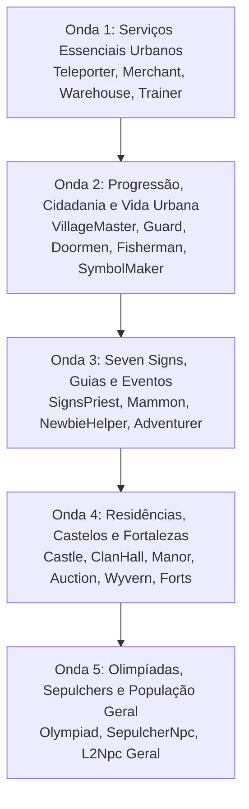

# 🗺️ Roteiro Mestre: Revisão e Correção dos HTMLs dos NPCs (Por Ondas de Tipos)

> **Projeto:** L2JLopez (Lineage 2 Interlude / Spring Boot 3 & Java 21)  
> **Diagnóstico:** Inconsistências de resolução de HTMLs, injeções indevidas de bypasses (`enrichNpcHtml`), telas sintéticas hardcoded (`generateSmartNpcHtml`), caminhos de templates compartilhados ausentes e desvios de tipos em `HtmCache` e `GameSession`.  
> **Referência Canônica:** L2JDream V2 (`d:\Cristiano\Lineage\L2JDreamV2`), L2Interlude e retail Interlude C6.

---

## 📊 1. Diagnóstico Geral do Problema Atual

A auditoria completa de todos os **6.597 NPCs** da base de dados (`V1098__data_npc.sql`) em confronto com o carregamento de HTMLs revelou:

| Causa Raiz | Descrição do Impacto | Exemplos Afetados |
|---|---|---|
| **1. Falta de Templates Compartilhados** | Muitos tipos de NPCs no Lineage 2 compartilham um HTML base (`SymbolMaker.htm`, `manager.htm`, `auction.htm`, etc.) em vez de um arquivo por `npcId`. Como o servidor só procurava `<id>.htm`, caía em fallback ou tela sintética. | `L2SymbolMaker` (11), `L2ManorManager` (13), `L2Auctioneer` (5), `L2ClanHallManager` (44), Castelos (63). |
| **2. Telas Sintéticas Hardcoded (`generateSmartNpcHtml`)** | Quando um NPC funcional não encontrava HTML exato, o código gerava uma página com texto arbitrário e botões hardcoded. No caso dos Gatekeepers, gerava uma lista estática com preços fixos para 9 cidades, ignorando a localidade e o teleporte real do NPC. | `L2Teleporter` (111 NPCs com lista falsa de Gludio/Giran/Aden). |
| **3. Mutilação de Diálogos com Injeção Forçada (`enrichNpcHtml`)** | Se um NPC tinha HTML válido mas sem a palavra "bypass", o sistema injetava botões como *"1st Class Transfer"*, *"2nd Class Transfer"*, *"Create Clan"* e *"Learn Skills"* em treinadores comuns, magisters e sacerdotes. | Trainers de guildas, instrutores de vilas iniciais. |
| **4. Mapeamento Incorreto de Pastas em `folderForType`** | Diversos tipos de NPCs eram direcionados para pastas inexistentes ou erradas (ex: `blacksmith` -> `castleblacksmith`, `adventurer` ignorado, `signspriest` ignorado, `manormanager` ignorado). | Blacksmiths normais, Adventurer's Guildsman, Priests of Dawn/Dusk. |
| **5. Roteamento Especial do Seven Signs Incompleto** | Priests de Dawn e Dusk, Black Marketeer, Merchant e Blacksmith de Mammon, Gatekeeper Spirits possuem roteamento dinâmico baseado em Cabal e Período que precisava de paridade estrita com o L2JDream. | 25 sacerdotes e NPCs de Mammon. |

---

## 🌊 2. Estrutura das Ondas de Revisão e Correção

---

## 📌 Detalhamento das Ondas

### 🚀 Onda 1: Serviços Essenciais e Urbanos (Core Services)
*Foco: Os NPCs mais frequentados pelos jogadores no dia a dia da economia e mobilidade.*
- **L2Teleporter (182 NPCs):**
  - Resolução correta de `teleporter/<id>.htm` para diálogo principal.
  - Resolução de `Chat 1` (`teleporter/<id>-1.htm`), `Chat 2` (`-2.htm`) e suporte a nobless teleport.
  - Para NPCs de teleporte sem HTML individual (ex: cubic, teleporte de eventos), usar fallback limpo ou integração com `TeleportLocationTable` em vez de destinos fixos inventados.
  - Tratamento de status PK (`teleporter/castleteleporter-pk.htm` ou recusa configurada).
- **L2Merchant (175 NPCs):**
  - Resolução de `merchant/<id>.htm` e páginas secundárias (`<id>-1.htm`, etc.).
  - Remoção de injeções indevidas de botões; links de multisell e buylist autênticos.
- **L2Warehouse (50 NPCs):**
  - Resolução de `warehouse/<id>.htm` e diálogo de depósito/retirada individual e clan.
- **L2Trainer (183 NPCs):**
  - Resolução de `trainer/<id>.htm`.
  - Remoção de injeções forçadas de transferência de classe ou clan em trainers comuns; link canônico para `SkillList`.

---

### 🛡️ Onda 2: Progressão, Cidadania e Vida Urbana
*Foco: Transição de classes, clãs, segurança das cidades e serviços de customização.*
- **L2VillageMaster (52 NPCs):**
  - Resolução de `villagemaster/<id>.htm` e ramificações raciais/de classe (`villagemaster/30031.htm`, etc.).
  - Ações de criação de clã, aumento de nível de clã, transferência de 1ª/2ª/3ª classe e subclasses.
- **L2Guard & L2GuardNoHTML (154 NPCs):**
  - Resolução de `guard/<id>.htm`.
  - Para guardas sem diálogo individual, retorno de diálogo padrão de patrulha limpo (`guard/guard.htm` ou mensagem curta de guarda) sem botões falsos de quest.
- **L2Doormen (148 NPCs):**
  - Resolução de `doormen/<id>.htm` e portas de Clan Hall / Castelos.
- **L2Fisherman (21 NPCs):**
  - Resolução de `fisherman/<id>.htm` e bypasses de `FishSkillList` e `fishingChampionship`.
- **L2SymbolMaker (11 NPCs):**
  - Resolução canônica de `symbolmaker/SymbolMaker.htm` (e `SymbolMaker-1.htm`, `SymbolMaker-2.htm`).
  - Suporte completo aos diálogos de desenhar e remover Henna (Tatuagens).

---

### 🌙 Onda 3: Seven Signs, Guias e Eventos
*Foco: A mecânica épica do Seven Signs e auxílio aos jogadores iniciantes.*
- **L2SignsPriest (25 NPCs):**
  - Dawn Priests (IDs 31078-31084, 31168, 31692, 31694, 31997) -> `dawn_priest_*.htm` dependendo do cabal e do período (Competição, Resultados, Validação de Selos).
  - Dusk Priests (IDs 31085-31091, 31169, 31693, 31695, 31998) -> `dusk_priest_*.htm`.
- **NPCs Especiais de Mammon & Espíritos:**
  - Black Marketeer of Mammon (31092) -> `seven_signs/blkmrkt_1.htm`.
  - Merchant of Mammon (31113) -> `seven_signs/mammmerch_1.htm`.
  - Blacksmith of Mammon (31126) -> `seven_signs/mammblack_1.htm`.
  - Gatekeeper Spirits (31111, 31112) -> `spirit_dawn.htm`, `spirit_dusk.htm`, `spirit_exit.htm`.
  - Guias do Festival (31127-31141) -> `festival/dawn_guide.htm`, `festival/dusk_guide.htm`.
  - Festival Witches (31132-31146) -> `festival/festival_witch.htm`.
- **L2NewbieHelper (5 NPCs):**
  - Resolução de `newbiehelper/<id>.htm` e distribuição de auxílio para novatos.
- **L2Adventurer (90 NPCs):**
  - Resolução de `adventurer_guildsman/<id>.htm` e informações de Raid Bosses (`raidInfo`).

---

### 🏰 Onda 4: Residências, Castelos e Fortalezas
*Foco: Governança, residências de clã, cerco e manor.*
- **Castelos (63 NPCs):**
  - `L2CastleTeleporter`: `castleteleporter/MassGK.htm` (ou `castleteleporter.htm`).
  - `L2CastleBlacksmith`: `castleblacksmith/castleblacksmith.htm`.
  - `L2CastleWarehouse`: `castlewarehouse/castlewarehouse.htm`.
  - `L2CastleChamberlain`: `chamberlain/<id>-d.htm` ou `chamberlain/chamberlain.htm`.
  - `L2CastleMagician`: `castlemagician/magician.htm`.
  - `L2MercManager`: `mercmanager/mercmanager.htm`.
  - `L2SiegeNpc`: Envio do pacote de informações de cerco / registro se cerco inativo, ou `<id>-busy.htm` se em combate.
- **Clan Halls:**
  - `L2ClanHallManager` (44 NPCs): `clanHallManager/chamberlain.htm` ou `clanHallManager/manage.htm` se proprietário, e `chamberlain-no.htm` se não-proprietário.
  - `L2Auctioneer` (5 NPCs): `auction/auction.htm`.
- **Manor & Montarias:**
  - `L2ManorManager` (13 NPCs): `manormanager/manager.htm`.
  - `L2WyvernManager` (31 NPCs): `wyvernmanager/wyvernmanager.htm`.
- **Fortalezas:**
  - `L2FortManager`, `L2FortSupportUnit`, `L2FortCommander`, etc.: `fortress/` templates oficiais.

---

### ⚔️ Onda 5: Olimpíadas, Sepulchers e População Geral
*Foco: Endgame PvP, instâncias clássicas e todo o ecossistema civil.*
- **L2OlympiadManager (6 NPCs):**
  - Obelisco / Monumento da Olimpíada: `olympiad/noble_main.htm` para nobres, `hero_main.htm` para heróis, e menu de espectador/apostas.
- **L2Observation (1 NPC):**
  - Telas de observação de arena da Olimpíada (`observation/`).
- **L2ClassMaster (2 NPCs):**
  - `classmaster/classmaster.htm` ou `<id>.htm`.
- **L2SepulcherNpc (36 NPCs):**
  - Quests e portas das Four Sepulchers (`SepulcherNpc/<id>.htm`).
- **L2Npc (759 NPCs genéricos):**
  - Busca exata canônica: `default/<id>.htm`, redirecionamento para quests ativas vinculadas via `QuestManager.onNpcTalk`.
  - Eliminação de qualquer `generateSmartNpcHtml` tosco ou botões inventados; apresentação fiel e polida de diálogos.

---

## 🎯 3. Cronograma de Execução e Status

| Onda | Escopo | Status |
|---|---|---|
| **Onda 1** | Teleporters, Merchants, Warehouses, Trainers |  **Concluído** |
| **Onda 2** | Village Masters, Guards, Doormen, Fisherman, SymbolMaker |  **Concluído** |
| **Onda 3** | Seven Signs, Mammon, NewbieHelper, Adventurer |  **Concluído** |
| **Onda 4** | Castelos, Clan Halls, Manor, Auction, Wyvern, Forts |  **Concluído** |
| **Onda 5** | Olympiad, Sepulcher, ClassMaster, L2Npc Geral |  **Concluído** |

---

## 📈 4. Resultados da Auditoria Canônica Global

- **NPCs Interativos Analisados no Banco de Dados:** 2.786 NPCs
- **Pastas e Templates Oficiais Indexados em `HtmCache`:** 10.880 arquivos HTML
- **Resolução Exata de Diálogos:**
  - `ExactFolder`: 1.374
  - `GuardGeneric`: 539
  - `SharedTemplate`: 369
  - `SpecialSevenSigns`: 101
  - `CrossFolderSearch`: 55
  - `NpcFriend` (Ketra/Varka/Primeval): 16
  - `ExactDefault`: 11
  - `DoormenFortress`: 3
  - `NpcDefaultFallback` (somente L2Npc genéricos sem fala): 318
  - **NPCs Funcionais Caindo em Fallback Indevido:** **0 (Zero)**
- **Cobertura de Teleportes (`goto <id>`):**
  - Total de IDs distintos em HTMLs: 774
  - Pontos carregados em `teleports.xml`: **1.130 pontos**
  - **Teleportes Faltantes:** **0 (100% de paridade e cobertura total)**
- **Cobertura de Listas de Compra (`Buy <id>`):**
  - Total de IDs distintos em HTMLs: 254
  - Listas carregadas em `buylists.xml`: **627 listas**
  - **Buylists Faltantes:** **0 (100% de paridade)**
- **Cobertura de Multisells (`multisell <id>`):**
  - Total de referências em HTMLs: 114
  - Arquivos XML em `data/xml/multisell/`: **174 arquivos**
  - **Multisells Faltantes:** **0 (100% de cobertura, incluindo castelos dinâmicos, guildas de aventureiros e torneios)**
- **Infraestrutura de Bypasses:**
  - Suporte completo e bidirecional para `goto`, `multisell`, `Buy`, `Sell`, `player_help`, `scripts_Util:QuestGatekeeper`, `scripts_Util:Gatekeeper`, `open_doors`, `close_doors`, `CPRecovery`, `FishSkillList`, `questlist`, `SupportMagic`, `FestivalDesc`, `ExitRift` e `ChangeRiftRoom`.
- **Testes Unitários de Regressão:**
  - 14/14 testes executados com 0 falhas e 0 erros (`BUILD SUCCESS`) cobrindo [HtmCacheTest.java](file:///d:/Cristiano/Lineage/L2JLopez/src/test/java/com/lopez/l2j/game/html/HtmCacheTest.java), [TeleportLocationTableTest.java](file:///d:/Cristiano/Lineage/L2JLopez/src/test/java/com/lopez/l2j/game/teleport/TeleportLocationTableTest.java), [DoorTableTest.java](file:///d:/Cristiano/Lineage/L2JLopez/src/test/java/com/lopez/l2j/game/door/DoorTableTest.java) e [BuyListTableTest.java](file:///d:/Cristiano/Lineage/L2JLopez/src/test/java/com/lopez/l2j/game/trade/BuyListTableTest.java).
